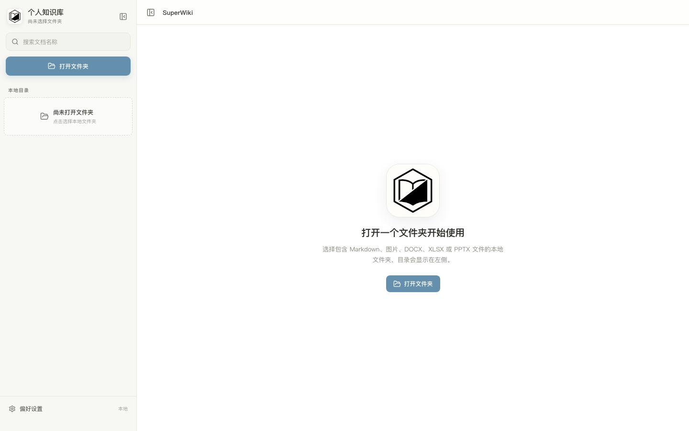

<div align="center">
  

# SuperWiki

**一个免费、本地优先的个人 Markdown 知识库。**


</div>

SuperWiki 用于打开本地文件夹，浏览、编辑和预览其中的 Markdown 文档及常见附件。文件保存在用户自己的电脑中，不需要注册账号，也不依赖云端同步。

> [!IMPORTANT]
> **本项目由 Vibe Coding 方式开发。** 项目的目标是提供一个可以免费使用的本地知识库工具，拒绝订阅、会员、付费解锁、功能分级等一切付费功能。未来新增能力也应优先采用免费、本地、开源或无需付费服务的实现。

## 截图



## 主要功能

- 打开并记住本地知识库文件夹
- 使用目录树浏览本地文件
- 编辑和自动保存 Markdown 文档
- 切换编辑与预览模式
- 预览常见图片和 Office 文件
- 支持 GFM 表格、任务列表、代码块、Mermaid 和 PlantUML 等内容
- 文件保留在本地，无账号、无云端存储、无付费功能

## 安装

### 方式一：下载安装包

前往 GitHub 仓库的 [Releases](../../releases) 页面，下载适合当前系统的最新安装包并完成安装。

> 如果 Releases 页面暂时没有适合你系统的安装包，请使用下面的源码运行方式。

### 方式二：从源码运行

开始前请安装：

- Node.js
- Rust
- 当前系统所需的 Tauri 开发依赖

克隆项目并安装依赖：

```bash
git clone <本仓库地址>
cd superwiki
npm ci
```

启动桌面应用：

```bash
npm run tauri dev
```

构建本地安装包：

```bash
npm run tauri build
```

在 macOS 上也可以运行交互式 DMG 构建脚本：

```bash
./build.sh
```

## 使用

1. 启动 SuperWiki。
2. 点击 **打开文件夹**，选择保存知识库的本地文件夹。
3. 在左侧目录中选择 Markdown 文档进行编辑，修改内容会自动保存。
4. 使用顶部的视图按钮切换编辑或预览模式。
5. 点击图片或支持的 Office 文件可以进行只读预览。
6. 下次启动时，应用会尝试恢复上次打开的文件夹。

建议在使用前自行备份重要文件。SuperWiki 会直接读写所选文件夹中的本地文档，目前不提供云端备份或历史版本恢复服务。

## 免费原则

SuperWiki 的开发目的不是商业化，而是获得一个真正可免费使用的个人知识库工具：

- 不提供付费版、专业版或会员版
- 不通过订阅解锁功能
- 不植入广告或付费推广
- 不强制接入需要付费的云服务或 AI 服务
- 不以免费额度引流后再设置付费墙
- 优先选择本地能力和可免费使用的依赖

如果某项功能必须依赖付费服务，它不应成为 SuperWiki 的必需功能，也不应影响已有免费功能的正常使用。

## 当前边界

- SuperWiki 是本地工具，不提供账号系统和云端同步。
- Office 文件目前以预览为主，不作为完整的 Office 编辑器使用。
- 删除 Markdown 中的图片引用不会自动删除本地图片文件。
- 项目仍在持续迭代，使用前请备份重要资料。
