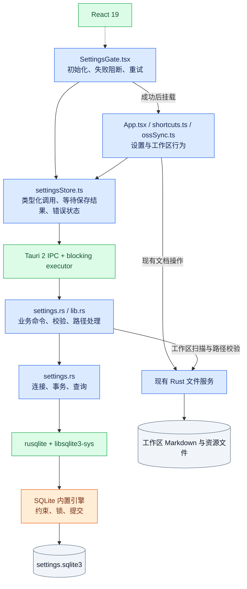
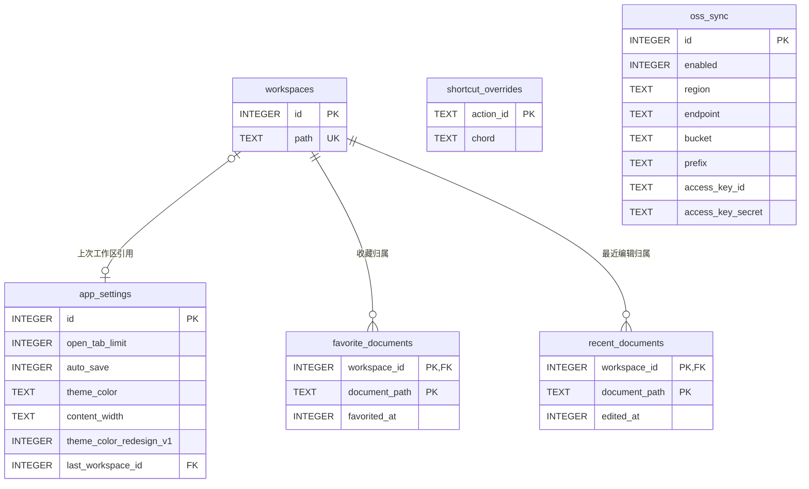
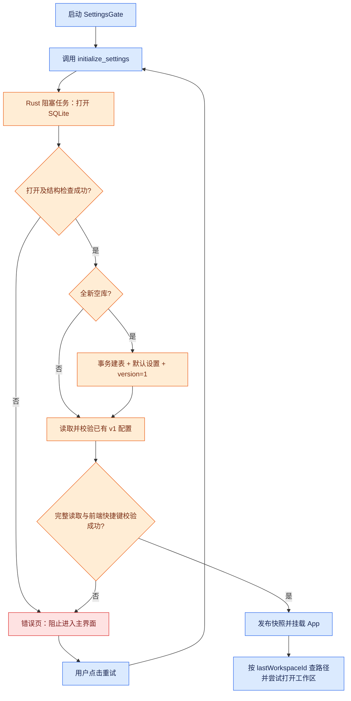
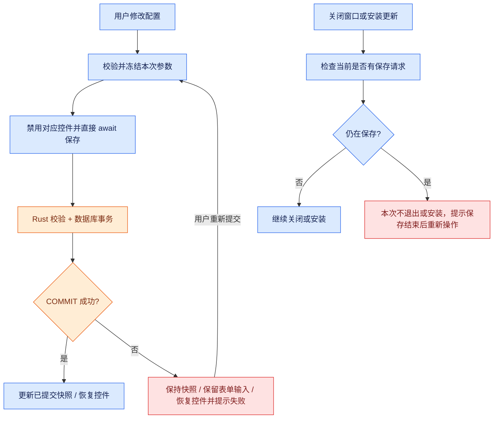
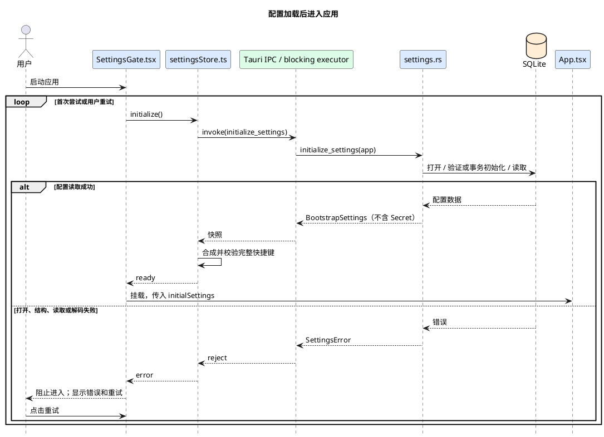
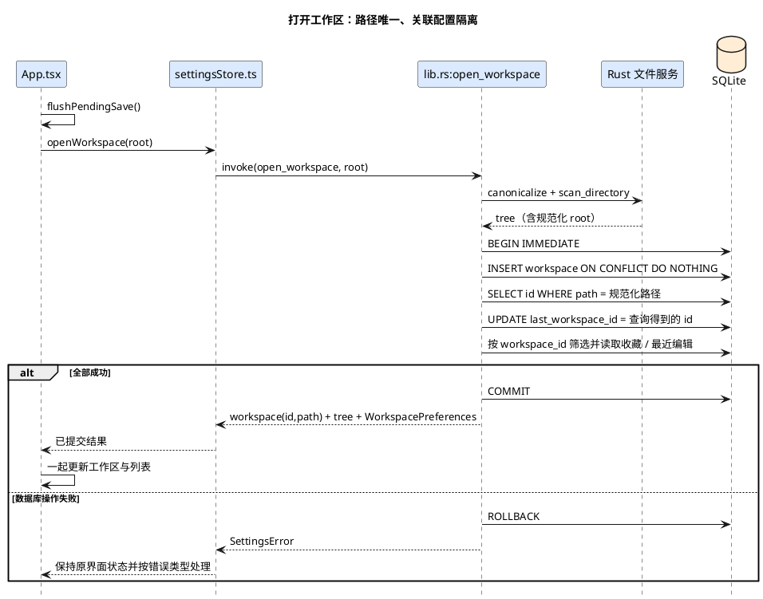
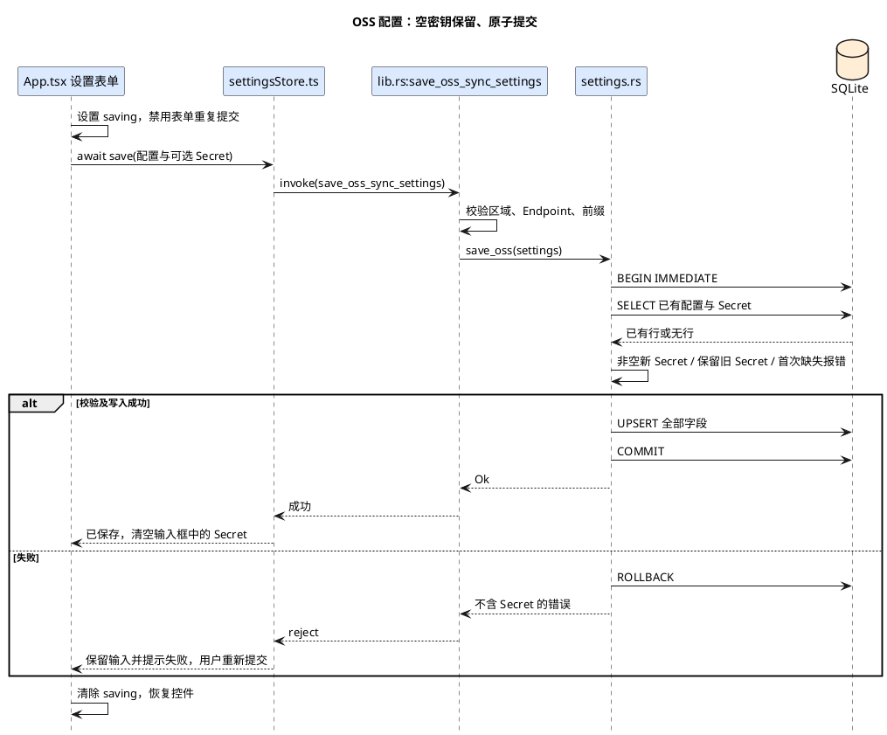

# 配置统一保存到 SQLite — 技术设计

状态：设计稿，仅描述后续实现，不代表代码已完成。

需求依据：[spec.MD](./spec.MD)。代码核对日期：2026-09-18；当前项目版本：0.8.3。本文中的新增文件、类型和方法均为拟定名称，伪代码内嵌在本文，不创建可执行实现文件。

## 1. 方案结论与边界

采用 **React → Tauri 业务命令 → Rust 配置模块 → rusqlite → 本地 SQLite 文件** 的单一路径。

1. SQLite 保存应用设置、工作区列表、工作区收藏和最近编辑、快捷键、OSS 配置及密钥，共六张业务表。
2. 工作区使用数据库生成的整数 ID 作为主键，规范化的文件夹路径保持 UNIQUE；其他表按 ID 关联，重复打开复用已有 ID，工作区记录不删除。
3. 启动先读取配置，成功后挂载主界面；失败只显示错误和重试，不使用默认值掩盖读取失败。
4. 不读取、导入、清理旧 JSON、localStorage 或系统凭据库。新数据库直接使用当前默认值。
5. 文档正文及资源继续经过现有 Rust 文件服务读写；不增加多工作区同时打开、列表管理界面、配置云同步或导入导出。

关键实现选择：配置存储使用显式字段和受约束的表；所有命令使用参数绑定；前端直接提交配置并等待结果，数据库提交成功才确认保存成功。配置保存不设计单一队列，不保留待执行/失败任务，失败由用户重新提交。数据库 API 不接受前端传入的数据库路径、SQL 或任意配置键。

## 2. 依赖与配置文件

### 2.1 新增、保留、移除的依赖

| 依赖 | 当前/拟采用版本 | 动作 | 作用及理由 |
| --- | --- | --- | --- |
| `rusqlite` | 新增 `0.40.2`，启用 `bundled` | 新增直接 Rust 依赖 | 提供连接、参数化 SQL、事务和类型转换；直接服务 Rust 文件能力层，避免将 SQL 暴露给前端。[官方 API](https://docs.rs/rusqlite/0.40.2/rusqlite/) |
| `libsqlite3-sys` 及 bundled SQLite | 由上述 rusqlite 的依赖约束解析，实施时由 `Cargo.lock` 固定 | 传递引入，不单独声明版本 | SQLite C 绑定及内置引擎；用户不必安装系统 SQLite。实际引擎版本在实现验证时用 `SELECT sqlite_version()` 记录，不凭 rusqlite 版本猜测。[features](https://docs.rs/crate/rusqlite/0.40.2/features) |
| `keyring` | 当前锁定 `3.6.3`，声明为 `3` + `windows-native` | 移除直接依赖及调用 | OSS 密钥已明确不再使用系统凭据库；锁文件仅移除因此不再被其他依赖使用的包 |
| `tauri` / `tauri-build` | 当前锁定 `2.11.5` / `2.6.3` | 保留，不升级 | 复用命令 IPC、应用配置目录、阻塞任务执行能力；不新增 SQLite 插件 |
| `serde` / `serde_json` | 当前锁定 `1.0.229` / `1.0.151` | 保留，不升级 | IPC DTO 序列化；`serde_json` 仍供现有功能使用，不因删除 OSS JSON 文件存储而全局移除 |

前端不新增 npm 运行时依赖。React 19、`@tauri-apps/api` 2、`ali-oss` 6 保持项目当前版本；OSS 网络同步仍使用现有 SDK。不引入 ORM、SQLx、连接池、SQLCipher 或 `tauri-plugin-sql`。

拟修改的依赖声明：

```toml
# src-tauri/Cargo.toml 的相关片段
rusqlite = { version = "0.40.2", features = ["bundled"] }
# 删除 keyring 声明；其他依赖不变。
```

`bundled` 会增加本地 C 编译和应用体积；实施时验证项目支持平台的构建工具链。版本依据为已核对的 [0.40.2 API](https://docs.rs/rusqlite/0.40.2/rusqlite/)，升级记录入口为 [rusqlite Releases](https://github.com/rusqlite/rusqlite/releases)。这是新增依赖，不要求升级现有 Tauri/React。

### 2.2 涉及的配置及数据文件清单

| 文件/位置 | 计划处理 | 具体内容 |
| --- | --- | --- |
| `src-tauri/Cargo.toml` | 修改 | 新增 rusqlite，移除 keyring |
| `src-tauri/Cargo.lock` | 更新 | 固定解析后的 rusqlite、SQLite 绑定及其他受影响的传递依赖 |
| `src-tauri/src/settings_schema.sql` | 新增 | 六张表、两个排序索引、禁止删除工作区的触发器；通过 `include_str!` 编入程序，不在用户目录另存 SQL 配置 |
| `src-tauri/tauri.conf.json` | 无需修改 | 保留 `identifier = com.superwiki.app`；数据库目录基于此标识解析，无新增 plugin 配置 |
| `src-tauri/capabilities/default.json` | 检查后保持现状 | 不添加 `sql:*`、前端文件系统或任意数据库访问权限；现有 `core:default` 与关闭窗口能力供生命周期处理使用 |
| `src-tauri/build.rs` | 无需修改 | 当前使用默认 `tauri_build::build()`，未启用应用命令白名单；新增命令在 `generate_handler!` 注册即可 |
| `package.json` | 仅增加测试脚本 | 拟新增 `test:settings = node --test tests/settings.test.mjs`，不改变依赖 |
| `package-lock.json`、`vite.config.ts`、`tsconfig.json` | 无需修改 | 不新增前端依赖或构建能力 |
| `<app_config_dir>/settings.sqlite3` | 新增运行时文件 | 应用私有配置数据库；Rust 决定路径，前端不可传入 |
| `<app_config_dir>/settings.sqlite3-journal` | SQLite 按需生成 | 回滚日志，由 SQLite 管理，不能由业务代码随意删除 |
| `<app_config_dir>/oss-sync.json` | 停止读写 | 保留磁盘上的旧文件，不迁移、不删除 |
| WebView localStorage 的九个旧键 | 停止读写 | 全部映射见第 4 节；不再用作缓存或降级源，不主动清除 |
| 系统凭据 `com.superwiki.app / oss-access-key-secret` | 停止访问 | 不读取、不迁移、不更新、不删除旧凭据 |
| `AGENTS.md`、项目说明中相关存储描述 | 实现后按需同步 | 将“无数据库”和 localStorage 配置说明更新为实际行为；不更改无关规范 |

应用命令与插件命令的权限规则不同。上述“不增加 SQL 权限”基于当前工程未配置 `AppManifest::commands` 的事实；若实施时工程启用应用命令 ACL，须将本文列出的命令加入对应 main-window 权限，不能照搬插件权限名。参见 [Tauri Capabilities](https://v2.tauri.app/security/capabilities/)。

### 2.3 数据库位置与运行参数

通过 `app.path().app_config_dir()?.join("settings.sqlite3")` 定位。Windows 通常为 `%APPDATA%\com.superwiki.app\settings.sqlite3`，macOS 通常为 `~/Library/Application Support/com.superwiki.app/settings.sqlite3`；运行时以 Tauri 返回值为准，不硬编码这些示例。[PathResolver](https://docs.rs/tauri/latest/tauri/path/struct.PathResolver.html#method.app_config_dir)

| 参数 | 选择 | 应用时机/目的 |
| --- | --- | --- |
| `PRAGMA foreign_keys` | `ON` | 每个连接在事务外开启，确保工作区关联有效 |
| `PRAGMA journal_mode` | `DELETE` | 初始化设置，后续核对；低频、小事务，无需 WAL 的常驻侧文件 |
| `PRAGMA synchronous` | `FULL` | 每个连接设置，提交成功后再报告保存完成 |
| `Connection::busy_timeout` | 5 秒 | 每个连接设置；锁超时返回可识别错误，不无限等待 |
| `PRAGMA user_version` | `1` | 首次建库事务设置；已有库必须符合本设计版本 |

`user_version` 是数据库结构版本，不是主题历史标记，也不是旧版本导入标记。本次不建立迁移历史表或通用升级框架。[SQLite PRAGMA](https://www.sqlite.org/pragma.html)、[rusqlite Connection](https://docs.rs/rusqlite/0.40.2/rusqlite/struct.Connection.html)

## 3. 架构

蓝色：本项目代码逻辑；绿色：第三方库/运行时；橙色：嵌入式存储中间件；灰色：本地数据。SQLite 是进程内引擎，不是独立数据库服务。



持久化只发生在 Rust。前端保留已提交快照和正在编辑的表单值，不创建第二套 localStorage 存储。普通启动快照不返回 OSS 密钥明文；只在现有 OSS 客户端需要凭据时调用专用命令。

## 4. 配置项与默认值完整映射

### 4.1 应用设置及旧 localStorage 键

| 原配置键 | 新存储 | 默认值/规则 |
| --- | --- | --- |
| `superwiki.workspaceRoot` | `app_settings.last_workspace_id` → `workspaces.id` | `NULL` 表示无上次工作区；关闭工作区时清空该引用，不删除工作区 |
| `superwiki.openTabLimit` | `app_settings.open_tab_limit` | `8`，正整数；跨 IPC 不得超过 JS 安全整数范围 |
| `superwiki.autoSave` | `app_settings.auto_save` | `true`，SQLite 保存 `1/0` |
| `superwiki.themeColor` | `app_settings.theme_color` | `sky`；可选 `yellow/sky/mint/coral/lavender` |
| `superwiki.contentWidth` | `app_settings.content_width` | `default`；可选 `default/full` |
| `superwiki.themeColorRedesignV1` | `app_settings.theme_color_redesign_v1` | 新库置 `1`，代表直接采用当前主题默认值；不执行旧版 yellow → sky 转换，也不覆盖已保存的 yellow |
| `superwiki.shortcuts` | `shortcut_overrides` | 无记录即采用现有默认快捷键；恢复默认时清空该表 |
| `superwiki.favoriteDocuments` | `favorite_documents` | 按工作区查询，初始为空 |
| `superwiki.recentEditedDocuments` | `recent_documents` | 按工作区查询，初始为空；每个工作区最多保留 20 条 |

新增 `workspaces` 列表初始为空。侧栏宽度、视图模式、当前打开的 Tab 集合等当前未持久化的 UI 状态，不因本次改动新增持久化。

### 4.2 全部可配置快捷键

`Mod` 沿用现有定义：macOS 为 Command，其他平台为 Ctrl。默认值继续由 `src/shortcuts.ts:SHORTCUT_DEFINITIONS` 提供；数据库只存用户覆盖项。

| action_id | 名称 | 默认 chord |
| --- | --- | --- |
| `bold` | 加粗 | `Mod+KeyB` |
| `italic` | 斜体 | `Mod+KeyI` |
| `inlineCode` | 行内代码 | `Mod+KeyE` |
| `codeBlock` | 代码块 | `Mod+Alt+KeyC` |
| `link` | 插入链接 | `Mod+KeyK` |
| `image` | 插入图片 | `Mod+Alt+KeyI` |
| `save` | 保存当前文档 | `Mod+KeyS` |
| `favorite` | 收藏/取消收藏 | `Mod+Shift+KeyD` |
| `toggleSidebar` | 左侧栏开关 | `Mod+Shift+KeyL` |
| `toggleOutline` | 右侧目录开关 | `Mod+Shift+KeyO` |
| `toggleView` | 编辑/预览切换 | `Mod+Shift+KeyE` |
| `toggleFullscreen` | 只读全屏 | `F11` |

现有保留键、冲突判断和展示格式仍由 `src/shortcuts.ts` 负责，作为代码规则而非新增用户配置。持久化方法改为纯数据输入/输出，不能继续在该文件中访问 localStorage。读取到未知 action、无效 chord 或冲突的完整绑定时应报告配置无效，不能继续沿用“解析失败就静默使用默认值”的旧逻辑。

### 4.3 OSS 全部配置项

| UI/DTO 属性 | 新存储 | 默认/校验 |
| --- | --- | --- |
| `enabled` | `oss_sync.enabled` | 未配置时 `false` |
| `region` | `oss_sync.region` | 表单空串；保存时 trim 后非空 |
| `endpoint` | `oss_sync.endpoint` | 表单空串；复用 `normalize_oss_endpoint`，无协议时补 https |
| `bucket` | `oss_sync.bucket` | 表单空串；保存时非空 |
| `prefix` | `oss_sync.prefix` | 表单默认 `superwiki`；保存时复用 `normalize_oss_prefix`，允许空目录，拒绝 `..` 路径段 |
| `accessKeyId` | `oss_sync.access_key_id` | 表单空串；保存时非空 |
| `accessKeySecret` | `oss_sync.access_key_secret` | 新库无密钥；首次保存必须填写；以后留空保留旧值 |
| `hasAccessKeySecret` | 不单独存储 | 根据 SQLite 中是否存在有效密钥计算，普通配置读取只返回此布尔值 |

OSS 尚未配置时 `oss_sync` 无记录，不插入一行空凭据。公开 DTO 不包含 Secret；凭据 DTO 沿用现有 `load_oss_sync_credentials` 消费方式。

## 5. 数据库设计

### 5.1 关系与通用约束

六张表均采用 SQLite `STRICT` 表。布尔值用 INTEGER 0/1，时间用 Unix 毫秒 INTEGER；返回 JS 前校验安全整数范围。工作区 ID 使用 SQLite 自动分配的 INTEGER PRIMARY KEY，不新增 UUID 依赖、软删除列或通用 JSON 配置表。



`app_settings.last_workspace_id` 可为空，因此应用可以没有上次工作区；非空时必须引用已有工作区。工作区根路径不会因收藏取消或文件删除而消失。SQLite 外键须逐连接开启，不能只依赖 DDL。[外键文档](https://www.sqlite.org/foreignkeys.html)

### 5.2 `workspaces`：工作区列表

| 字段 | 类型/约束 | 含义 |
| --- | --- | --- |
| `id` | INTEGER PRIMARY KEY，正的 JS 安全整数 | 数据库插入时自动分配的工作区 ID；其他表的关联依据；重复打开后保持不变 |
| `path` | TEXT，UNIQUE，NOT NULL，非空 | Rust 规范化后的工作区绝对路径；用于识别和去重，同一路径只能对应一个 ID |

展示名称由路径末级目录派生；根目录无末级名称时展示路径。不存冗余名称或未提出需求的最后访问时间。插入省略 id，使用 `ON CONFLICT(path) DO NOTHING`，随后在同一事务内按 path 查询 id，无论新增还是已存在都取得正确 ID；不使用 REPLACE，也不依赖冲突后的 last_insert_rowid。设置禁止 DELETE 的触发器，服务层也不提供删除工作区命令。

选择 INTEGER PRIMARY KEY 自动生成 ID，不使用 AUTOINCREMENT：工作区不删除，无需为“已删除 ID 永不复用”增加序列表维护。ID 仅在当前本地数据库内唯一，跨数据库合并不在本次范围。参见 [SQLite INTEGER PRIMARY KEY / AUTOINCREMENT](https://www.sqlite.org/autoinc.html)。

### 5.3 `app_settings`：应用级单例设置

| 字段 | 类型/约束 | 默认值 | 含义 |
| --- | --- | --- | --- |
| `id` | INTEGER PRIMARY KEY，CHECK `id = 1` | `1` | 唯一设置行 |
| `open_tab_limit` | INTEGER NOT NULL，`1..9007199254740991` | `8` | 可打开 Tab 数量上限 |
| `auto_save` | INTEGER NOT NULL，0/1 | `1` | 文档自动保存开关 |
| `theme_color` | TEXT NOT NULL，限定五种主题 | `sky` | 主题选择 |
| `content_width` | TEXT NOT NULL，`default/full` | `default` | 内容宽度 |
| `theme_color_redesign_v1` | INTEGER NOT NULL，0/1 | `1` | 主题历史标记，不与数据库版本混用 |
| `last_workspace_id` | INTEGER NULL，外键 → `workspaces.id` | `NULL` | 上次工作区；清空只更改该字段 |

### 5.4 `shortcut_overrides`：快捷键覆盖项

| 字段 | 类型/约束 | 含义 |
| --- | --- | --- |
| `action_id` | TEXT PRIMARY KEY NOT NULL，限定第 4.2 节 12 个值 | 对应快捷键动作 |
| `chord` | TEXT NOT NULL，非空 | 如 `Mod+Shift+KeyB`；保存和读取时进行语法/冲突校验 |

仅对已覆盖项建立 `UNIQUE(chord)` 不能检查其与未覆盖默认快捷键的冲突，所以不依赖该索引解决业务校验。前端提交前和启动合成完整绑定后均调用同一套现有校验；Rust 校验动作枚举、字符串格式和重复覆盖值。

### 5.5 `oss_sync`：OSS 单例配置及凭据

| 字段 | 类型/约束 | 含义 |
| --- | --- | --- |
| `id` | INTEGER PRIMARY KEY，CHECK `id = 1` | 唯一配置行；未配置时无行 |
| `enabled` | INTEGER NOT NULL，0/1 | 同步启用状态 |
| `region` | TEXT NOT NULL，非空 | OSS 区域 |
| `endpoint` | TEXT NOT NULL，非空 | 经现有规则归一化的 Endpoint |
| `bucket` | TEXT NOT NULL，非空 | Bucket 名称 |
| `prefix` | TEXT NOT NULL，可为空 | 远端对象前缀 |
| `access_key_id` | TEXT NOT NULL，非空 | AccessKey ID |
| `access_key_secret` | TEXT NOT NULL，非空 | AccessKey Secret，随配置在同一事务保存 |

### 5.6 `favorite_documents`：工作区收藏

| 字段 | 类型/约束 | 含义 |
| --- | --- | --- |
| `workspace_id` | INTEGER NOT NULL，外键 → `workspaces.id`，联合主键第 1 列 | 所属工作区 |
| `document_path` | TEXT NOT NULL，非空，联合主键第 2 列 | 相对工作区根目录的 Markdown 路径，统一 `/` 分隔 |
| `favorited_at` | INTEGER NOT NULL，非负安全整数 | 收藏时间，毫秒；重复“设为收藏”不刷新原时间 |

索引 `favorite_documents_order(workspace_id, favorited_at DESC, document_path ASC)` 用于工作区列表查询与稳定排序。取消收藏可删除该表对应记录，禁止删除工作区并不禁止取消收藏。

### 5.7 `recent_documents`：工作区最近编辑

| 字段 | 类型/约束 | 含义 |
| --- | --- | --- |
| `workspace_id` | INTEGER NOT NULL，外键 → `workspaces.id`，联合主键第 1 列 | 所属工作区 |
| `document_path` | TEXT NOT NULL，非空，联合主键第 2 列 | 相对根目录的 Markdown 路径，统一 `/` 分隔 |
| `edited_at` | INTEGER NOT NULL，非负安全整数 | 文档成功落盘对应的时间，毫秒 |

索引 `recent_documents_order(workspace_id, edited_at DESC, document_path ASC)`；同一事务执行 upsert 与该工作区的超过 20 条裁剪。相同时间以路径升序稳定排序，不跨工作区裁剪。

两张文档表均不保存重复的 `name/root/relativePath` 展示字段：通过 workspace_id 关联 workspaces.id 取得根路径，名称从相对路径派生，现有前端 DTO 的绝对 `path` 由根目录与相对路径构造。文件安全检查仍必须重新执行，数据库 ID 或记录不等于文件访问授权。

### 5.8 完整建表草案

以下 SQL 拟放入 `src-tauri/src/settings_schema.sql`；事务、默认单例行和 `user_version` 由初始化函数控制，不重复散落在各个命令中。

```sql
CREATE TABLE workspaces (
    id INTEGER PRIMARY KEY CHECK(id BETWEEN 1 AND 9007199254740991),
    path TEXT NOT NULL UNIQUE CHECK(length(path) > 0)
) STRICT;

CREATE TABLE app_settings (
    id INTEGER PRIMARY KEY CHECK(id = 1),
    open_tab_limit INTEGER NOT NULL DEFAULT 8
        CHECK(open_tab_limit BETWEEN 1 AND 9007199254740991),
    auto_save INTEGER NOT NULL DEFAULT 1 CHECK(auto_save IN (0, 1)),
    theme_color TEXT NOT NULL DEFAULT 'sky'
        CHECK(theme_color IN ('yellow', 'sky', 'mint', 'coral', 'lavender')),
    content_width TEXT NOT NULL DEFAULT 'default'
        CHECK(content_width IN ('default', 'full')),
    theme_color_redesign_v1 INTEGER NOT NULL DEFAULT 1
        CHECK(theme_color_redesign_v1 IN (0, 1)),
    last_workspace_id INTEGER REFERENCES workspaces(id) ON DELETE RESTRICT
) STRICT;

CREATE TABLE shortcut_overrides (
    action_id TEXT PRIMARY KEY NOT NULL CHECK(action_id IN (
        'bold', 'italic', 'inlineCode', 'codeBlock', 'link', 'image',
        'save', 'favorite', 'toggleSidebar', 'toggleOutline',
        'toggleView', 'toggleFullscreen'
    )),
    chord TEXT NOT NULL CHECK(length(chord) > 0)
) STRICT;

CREATE TABLE oss_sync (
    id INTEGER PRIMARY KEY CHECK(id = 1),
    enabled INTEGER NOT NULL CHECK(enabled IN (0, 1)),
    region TEXT NOT NULL CHECK(length(trim(region)) > 0),
    endpoint TEXT NOT NULL CHECK(length(trim(endpoint)) > 0),
    bucket TEXT NOT NULL CHECK(length(trim(bucket)) > 0),
    prefix TEXT NOT NULL,
    access_key_id TEXT NOT NULL CHECK(length(trim(access_key_id)) > 0),
    access_key_secret TEXT NOT NULL CHECK(length(trim(access_key_secret)) > 0)
) STRICT;

CREATE TABLE favorite_documents (
    workspace_id INTEGER NOT NULL REFERENCES workspaces(id) ON DELETE RESTRICT,
    document_path TEXT NOT NULL CHECK(length(document_path) > 0),
    favorited_at INTEGER NOT NULL CHECK(favorited_at BETWEEN 0 AND 9007199254740991),
    PRIMARY KEY(workspace_id, document_path)
) STRICT;

CREATE TABLE recent_documents (
    workspace_id INTEGER NOT NULL REFERENCES workspaces(id) ON DELETE RESTRICT,
    document_path TEXT NOT NULL CHECK(length(document_path) > 0),
    edited_at INTEGER NOT NULL CHECK(edited_at BETWEEN 0 AND 9007199254740991),
    PRIMARY KEY(workspace_id, document_path)
) STRICT;

CREATE INDEX favorite_documents_order
    ON favorite_documents(workspace_id, favorited_at DESC, document_path ASC);
CREATE INDEX recent_documents_order
    ON recent_documents(workspace_id, edited_at DESC, document_path ASC);

CREATE TRIGGER workspaces_no_delete
BEFORE DELETE ON workspaces
BEGIN
    SELECT RAISE(ABORT, 'workspace records cannot be deleted');
END;
```

本设计的约束和索引为项目方案；语法依据为 [STRICT 表](https://www.sqlite.org/stricttables.html)、[UPSERT](https://www.sqlite.org/lang_upsert.html)、[CREATE TRIGGER](https://www.sqlite.org/lang_createtrigger.html)。相对路径的段级校验放在 Rust，不依靠 SQL 字符串 CHECK 判断路径安全。

## 6. 改动模块与接口契约

### 6.1 文件级改动

| 文件 | 动作 | 责任 |
| --- | --- | --- |
| `src-tauri/src/settings.rs` | 新增 | DTO、连接和建库、六表查询/写入、配置命令、结构化错误 |
| `src-tauri/src/settings_schema.sql` | 新增 | 第 5.8 节结构定义 |
| `src-tauri/src/lib.rs` | 修改 | 注册配置命令；新增工作区打开入口；OSS 命令换用 SQLite；复用现有路径与文件扫描函数 |
| `src/settingsStore.ts` | 新增 | IPC DTO、启动快照、直接保存调用及读取错误订阅；无配置任务队列或持久化镜像 |
| `src/SettingsGate.tsx` | 新增 | 初次加载、失败页、重试以及运行中读错误阻断层 |
| `src/main.tsx` | 修改 | 从直接渲染 App 改为渲染 SettingsGate |
| `src/App.tsx` | 修改 | 从快照初始化设置；替换九个存储键及相关辅助函数；工作区、收藏、最近编辑、重命名/删除、退出/更新入口接入命令 |
| `src/shortcuts.ts`、`src/contentWidth.ts` | 修改 | 保留纯校验/展示，移除旧持久化键和 localStorage 访问 |
| `src/ossSync.ts` | 小幅修改 | 继续调用原 OSS 命令；将结构化配置读取错误交给统一阻断机制 |
| `src/AppUpdater.tsx` | 必要时小幅调整 | 协调已有安装中禁止关闭逻辑；不得出现另一监听器直接 destroy 绕过安装保护 |
| `src/App.css` | 最小新增 | 配置加载/错误/重试和保存失败提示样式，不重设计设置页面 |
| `tests/settings.test.mjs` | 新增 | 启动重试、等待保存结果、防重复提交、失败后用户重新提交及保存中关闭保护 |
| `src-tauri/src/settings.rs` 内测试模块 | 新增 | SQLite 行为、路径隔离、失败回滚与重启测试 |

### 6.2 DTO 约定

Rust 使用 `#[serde(rename_all = "camelCase")]` 对齐 TypeScript。下列为接口形状，不是完整实现：

```ts
type AppPreferences = {
  openTabLimit: number; autoSave: boolean;
  themeColor: "yellow" | "sky" | "mint" | "coral" | "lavender";
  contentWidth: "default" | "full";
  themeColorRedesignV1: boolean;
  lastWorkspaceId: number | null;
};
type PreferenceChange =
  | { key: "openTabLimit"; value: number }
  | { key: "autoSave"; value: boolean }
  | { key: "themeColor"; value: AppPreferences["themeColor"] }
  | { key: "contentWidth"; value: AppPreferences["contentWidth"] };
type WorkspaceRecord = { id: number; path: string };
type BootstrapSettings = {
  preferences: AppPreferences;
  shortcutOverrides: Partial<Record<ShortcutId, string>>;
  oss: OssSyncSettings | null; // 现有公开 DTO，无 secret
  workspaces: WorkspaceRecord[];
};
type WorkspacePreferences = {
  workspaceId: number; root: string;
  favorites: FavoriteDocument[]; recent: RecentEditedDocument[];
};
type OpenWorkspaceResult = {
  workspace: WorkspaceRecord; tree: WorkspaceTree; preferences: WorkspacePreferences;
};
type SettingsError = {
  kind: "storage" | "validation" | "workspace";
  operation: "initialize" | "read" | "write";
  code: string; message: string;
};
```

仅四项普通偏好允许前端更新；`lastWorkspaceId` 只能通过打开/关闭工作区操作更新；历史主题标记由初始化逻辑管理。错误信息不得带 Secret 或含参数的完整 SQL。网络错误和文件夹不存在不能伪装成配置数据库损坏。

启动恢复时，用 lastWorkspaceId 在快照的 workspaces 中定位 path，再调用 open_workspace；非空 ID 查不到对应记录视为配置关联错误，不默认清空。当前工作区上下文和文档保存事件同时携带 workspaceId 与原有 root/path，元数据调用捕获所属 ID，不能在保存完成后改用“当时正打开的工作区”ID。

### 6.3 Rust 命令清单：文件、方法、参数、返回及逻辑

共同规则：命令形如 `async fn command(app: AppHandle, ...) -> Result<T, SettingsError>`；复制拥有所有权的参数后用 `tauri::async_runtime::spawn_blocking` 执行 SQLite/目录扫描，连接在闭包内创建并关闭。表中省略公共 `app` 参数；`generate_handler!` 注册下列全部新命令，保留现有其他命令。

| 文件:方法 | 输入 | 返回 | 核心逻辑 |
| --- | --- | --- | --- |
| `settings.rs:initialize_settings` | 无 | `BootstrapSettings` | 初始化或验证数据库，读取全部表并校验字段/关联；只向前端返回全局启动快照，不带密钥或所有工作区文档内容 |
| `settings.rs:update_app_preference` | `change: PreferenceChange` | `AppPreferences` | 验证枚举和值，静态匹配允许更新的列，单项更新并返回提交后的值；不用前端列名拼 SQL |
| `settings.rs:save_shortcut_overrides` | `overrides: Map<ShortcutId, String>` | 覆盖项映射 | 校验后事务替换覆盖表；空映射即恢复默认 |
| `lib.rs:open_workspace` | `root: String` | `OpenWorkspaceResult` | 规范化、完整扫描成功后，事务内按路径取得已有或新建 ID、更新上次工作区 ID、筛选失效文档记录，返回工作区 ID/路径、树及偏好 |
| `settings.rs:close_workspace` | 无 | `()` | 将 last_workspace_id 设 NULL；保留工作区和所有收藏/最近编辑 |
| `settings.rs:load_workspace_preferences` | `workspaceId: i64` | `WorkspacePreferences` | 先查已有 ID 对应的根路径，再按 ID 查询；严格解码；不依赖文件夹此刻存在，不隐式新增工作区 |
| `settings.rs:set_document_favorite` | `workspaceId: i64, path: String, favorite: bool` | 本工作区收藏列表 | 按 ID 查根路径并验证文件归属；显式设为收藏/取消，幂等插入或删除 |
| `settings.rs:record_recent_edit` | `workspaceId: i64, path: String, editedAt: i64` | 本工作区最近编辑列表 | 按 ID 查根路径并验证归属；文档落盘后调用，时间在落盘事件创建时固定；事务 upsert + 限 20 条 |
| `settings.rs:remap_workspace_documents` | `workspaceId: i64, oldPath, newPath: String, isDir: bool` | `WorkspacePreferences` | 按 ID 查根路径；重命名成功后两张文档表按 workspace_id 和路径段边界更新；保持时间 |
| `settings.rs:remove_workspace_documents` | `workspaceId: i64, path: String, isDir: bool` | `WorkspacePreferences` | 按 ID 查根路径；删除后清理两张表中所属记录；采用受根目录约束的词法路径校验 |
| `lib.rs:load_oss_sync_settings`（保留名称） | 无 | `Option<OssSyncSettings>` | 从 SQLite 返回非密钥字段和 hasAccessKeySecret |
| `lib.rs:save_oss_sync_settings`（保留名称） | `settings: OssSyncSettingsInput` | `()` | 复用现有 Endpoint/前缀规则，事务合并保留或更新 Secret，再保存整行 |
| `lib.rs:load_oss_sync_credentials`（保留名称） | 无 | `OssSyncCredentials` | 从 SQLite 读取包含 Secret 的凭据，仅供现有 OSS SDK 使用 |

`lib.rs:list_workspace` 保持只读扫描：现有上传后刷新、创建/重命名/删除后刷新和 OSS 全量同步也调用它，不能让每次刷新隐式更改“上次工作区”。首次用户选择/启动恢复改调 `open_workspace`。工作区列表已在初始化快照返回，本次不新增列表 UI 或专门删除命令。

内部方法：

| 文件:方法 | 参数 | 逻辑 |
| --- | --- | --- |
| `settings.rs:database_path` | `app: &AppHandle` | 解析固定配置路径，不接受用户选择路径 |
| `settings.rs:open_database` | `path: &Path, mode: InitializeOrExisting` | 设置第 2.3 节参数；普通操作不带 CREATE，防止运行中数据库丢失时静默新建 |
| `settings.rs:initialize_schema` | `conn: &mut Connection` | IMMEDIATE 事务中处理全新库与 v1 校验，禁止修复性清空 |
| `settings.rs:read_and_validate` | `conn: &Connection` | 六表严格解码、外键一致性检查；只将“允许无行”解释为未配置 |
| `settings.rs:normalize_workspace_path` | `root: &Path` | 新打开时 canonicalize + 必须是目录 + UTF-8 可无损表示；返回与树一致的唯一去重路径 |
| `settings.rs:ensure_workspace` | `tx, path: &str` | INSERT 按 path 忽略冲突，再 SELECT id WHERE path = ?；返回已有或新建的 WorkspaceRecord |
| `settings.rs:workspace_by_id` | `conn, workspace_id: i64` | 查询工作区 ID 和路径；无此 ID 返回错误，不按前端路径另建记录 |
| `settings.rs:document_key` | `root: &Path, path: &Path, must_exist: bool` | 返回受约束的相对路径；不存在路径仅用于删除/重命名旧记录，不作为文件读取授权 |
| `settings.rs:reconcile_documents` | `tx, workspace_id, validMarkdownPaths` | 扫描完整成功后，只清理该 ID 的失效文档记录，不删除工作区 |

### 6.4 前端方法清单

| 文件:方法 | 参数 | 逻辑 |
| --- | --- | --- |
| `settingsStore.ts:initialize` | 无 | 复用正在进行的初始化 Promise；失败后清除该 Promise，允许真正重试 |
| `settingsStore.ts:save` | `command, typedArgs` | 立即发起 IPC 并返回 Promise；调用方 await，成功后更新此次操作对应的快照字段；失败直接返回，不保留或重放任务 |
| `settingsStore.ts:isSaving` | 无 | 只查询进行中的保存数量是否大于零，供关闭/安装判断；不保存任务列表或待执行操作 |
| `settingsStore.ts:retryRead` | 失败读取操作描述 | 重试相同查询，更新可用快照后解除阻断；不清空编辑中的文档 |
| `SettingsGate.tsx:SettingsGate` | 无 | 首次 loading/error/ready 三态；ready 前不挂载 App；提供错误提示与重试 |
| `App.tsx:App` | `initialSettings: BootstrapSettings` | 设置初始化全部来自快照；删除主题初始化期间的 localStorage 写入 |
| `App.tsx:loadWorkspace` | `root: string` | 保留文档保存步骤，调用 open_workspace 成功后一起应用树和本工作区配置 |
| `App.tsx:toggleActiveFileFavorite` | 无 | 捕获当前 workspaceId/path，根据已提交状态生成显式 favorite 值，等待结果后更新 UI |
| `App.tsx:recordRecentEdit` | `file, editedAt` | 正文已成功写入后记录；失败独立提示“文档已保存，最近编辑记录未保存” |
| `App.tsx:closeWindow` / `prepareUpdateInstall` | 无 | 配置仍在保存时提示等待，本次关闭/安装不执行；保存结束后用户重新操作；不自动补交失败的配置 |
| `shortcuts.ts:readShortcutBindings` | `overrides` | 改为纯合成校验函数，不再自行读存储 |
| `shortcuts.ts:saveShortcutBindings` | `bindings` | 提取覆盖项交由 settingsStore，返回 Promise，调用处 await |

## 7. 核心流程与算法

### 7.1 启动门控、幂等初始化与重试

关键点：**不在 Tauri setup 中因数据库错误退出进程**，否则前端没有机会展示重试。setup 只保持现有窗口初始化；由前端 gate 调用初始化命令。[Tauri 命令](https://v2.tauri.app/develop/calling-rust/)

连接和建表在阻塞任务中完成。初始化事务拿到写锁后再判断版本：`user_version = 0` 且不存在任何用户表、视图、索引或触发器的全新空库，创建六表、默认 app_settings 行并设为 1；已有 v1 完整校验。v1 缺表/缺唯一设置行、非零未知版本、字段非法，均返回错误，不执行“补表并覆盖默认值”。不能把带有其他未知表的 version=0 数据库视为新库。事务失败自动回滚；留下空新库时下次初始化可再试。更高版本明确报不支持，不降级解释。



StrictMode 开发环境可能重复执行 effect：前端复用 in-flight 请求并清理订阅；数据库建库在事务中幂等，不在 React render 或 useState initializer 中执行写入。[React StrictMode](https://react.dev/reference/react/StrictMode)

启动快照校验数据库记录，不遍历所有历史文件夹。上次工作区已被移动导致扫描失败属于文件系统错误：应用仍可进入无工作区状态并提示重新选择；历史 workspaces 记录不删。SQLite 读取失败才触发数据库阻断。

运行中发生配置读取错误时复用全局错误层，暂停主界面交互并提供相同查询的重试；**不卸载已经挂载的 App/编辑器**，不丢失文档草稿。重试期间不自动恢复或切换工作区；只在成功后恢复交互。

### 7.2 工作区唯一标识与关联写入

关键点：ID 是表间关联主键，path 是唯一去重键。新打开时复用 Rust `fs::canonicalize` 解析绝对路径及符号链接，验证目录，树中 root 和数据库 path 必须使用同一个结果，再按该路径取得 ID。不要给所有平台简单 `toLowerCase()`，避免混淆大小写敏感目录；Windows、macOS、Linux 的等价路径表现需平台测试。Rust 官方说明见 [canonicalize](https://doc.rust-lang.org/std/fs/fn.canonicalize.html)。

目录扫描必须先成功，才开始短数据库事务：

```text
INSERT INTO workspaces(path) VALUES (?) ON CONFLICT(path) DO NOTHING
SELECT id, path FROM workspaces WHERE path = ?
UPDATE app_settings SET last_workspace_id = <查询得到的 id> WHERE id = 1
按 workspace_id 读取并依据完整扫描结果筛选本工作区收藏/最近编辑
COMMIT
```

此事务同时确定工作区 ID 和上次工作区引用，不产生悬空外键。不同根目录即使拥有相同 `notes/a.md`，也因不同 workspace_id 而独立；重复打开同一路径始终复用同一 ID。工作区路径在外部移动后，新路径是新工作区并分配新 ID，原记录保留；新增 ID 不代表自动识别根目录移动，本次不增加按 inode 或目录名自动合并的规则。

后续元数据命令传 workspaceId，由 Rust 查询可信的根路径再做文件边界检查，不能用用户传入的 ID 搭配未经验证的任意根目录。现有文档正文读写命令继续保留 root/path 参数和原安全校验，不因本次关联调整整体重构。

文档路径使用路径组件去掉根目录后保存相对路径；拒绝绝对相对值、`..`、根目录本身和越界符号链接。不能用字符串 `startsWith(root)` 作为安全检查，例如 `/notes2` 不是 `/notes` 子目录。已失效历史工作区的列表读取不 canonicalize，否则无法保留和展示失效路径。

### 7.3 同步保存流程与“立即关闭”

“同步保存”指业务流程等待结果：事件处理函数直接 `await` Rust IPC，成功后才确认本次修改。IPC 仍为异步 Promise，Rust SQLite 操作仍使用 blocking executor，不阻塞浏览器主线程，也不增加前端任务队列。

1. 用户提交时先校验参数，再立即发起保存；对应控件或表单在请求结束前禁用重复提交，使用同步设置的 ref 防止同一事件周期内重复点击。
2. 成功后更新已提交快照并恢复控件。独立配置字段可分别保存，但每个响应只更新本次提交的字段，不能用返回的整份 AppPreferences 覆盖其他字段的新值。
3. 失败后保持已提交快照不变，恢复控件并显示错误；输入保留在表单，用户通过原保存入口重新提交。无后台重试、任务重放或自动补交。即时保存的开关/主题选择失败时保留用户选择为未保存草稿，并提供当前项的“重新提交”入口。
4. 同一份完整数据共用保存态，例如全部快捷键为一组、OSS 表单为一组；保存期间不能再次提交该组，避免旧响应覆盖新操作。工作区切换及元数据操作按所属工作区协调已有交互，根路径随请求捕获，不创建调度器。
5. 只记录当前进行中的保存数量供关闭/安装判断，不保存请求清单、失败操作集合或待执行任务。一次请求结束即减少数量，失败不永久占用保存态。



自绘关闭按钮及系统 Alt+F4/窗口关闭在仍有配置保存请求时阻止本次退出，提示保存结束后重新关闭，不登记延迟关闭任务。已有失败请求已经结束时，用户可修改并重新提交，也可退出；不自动保存其草稿，不因历史失败永久阻止退出。和 `AppUpdater` 已有安装中禁止关闭逻辑协调，不能绕过安装保护。`prepareUpdateInstall` 先检查配置是否正在保存，若是则结束本次安装请求并提示；否则沿用现有安装中禁止交互及文档保存流程，完成后再安装，无配置 flush 方法。

此保证覆盖正常关闭和已经确认提交的操作，不承诺操作系统强杀前尚未完成的 IPC 能提交。数据库提交级保证采用事务及 FULL 同步；文档自动保存开关语义不因配置退出流程而改变。

### 7.4 最近编辑、收藏及文件变更

最近编辑：正文写入成功后才产生记录；`editedAt` 在该次成功事件捕获，失败重试用同一时间，不因重试把旧事件变成最新编辑。upsert 对旧时间使用 `MAX(原时间, 新时间)` 防止迟到重试倒退；同事务按 `edited_at DESC, document_path ASC` 保留 20 条。SQL 使用工作区参数限定所有查询和裁剪。

收藏：命令采用 `favorite: true/false`，不使用服务器端 toggle。重复提交 true 不重复新增，重复提交 false 无副作用，满足失败重试和重复点击的幂等性。

重命名/删除：保留当前文件操作入口，在文件系统操作成功后对两张文档表执行一次事务更新。目录重命名按路径段前缀匹配，不能用未转义 SQL LIKE 匹配含 `%`、`_` 的文件名。先查询本工作区受影响记录，在 Rust 中按组件构造新相对路径，再绑定参数更新。删除只清理文档表，不调用 workspaces DELETE。

文件系统和 SQLite **不能构成同一个原子事务**。若文件已改名但数据库更新失败，提示“文件已改名，收藏/最近编辑更新失败”，由当前操作界面提供“重新提交记录更新”，仅重新调用元数据保存，不重复文件重命名。界面只保留该次操作的路径参数，不注册后台任务或自动重试；用户点击后立即发起请求。失败提示尚在处理时不执行该工作区的失效记录裁剪。用户离开该界面或退出应用不会自动补交；下次完整扫描仍按现有规则筛除失效记录。本次不引入跨文件系统恢复日志，因此不承诺未成功保存的重命名关联能在退出后恢复。

文档内容保存成功但 recent 写入失败时分别表达两个结果，不能把已落盘正文标成未保存，也不能吞掉元数据错误。自动保存、手动保存、flushPendingSave 和更新前保存都需要覆盖这个调用顺序。快速切换时，列表读取回包带 workspaceId，列表写入回包使用发起请求时捕获的 workspaceId；只有仍属于当前工作区才更新当前列表，防止 A 的迟到结果覆盖 B。

### 7.5 OSS 密钥保存

关键点：将此前 JSON 与 keyring 的两次独立保存改成单个 SQLite 事务。事务中读取已有密钥；输入为空且已有密钥则保留；两者都没有则校验失败；输入非空则替换。其他字段和密钥一起 COMMIT，不出现一半新配置、一半旧密钥。

本方案按需求直接将 Secret 保存为 SQLite TEXT，不引入系统凭据库或额外加密密码。普通 SQLite 不提供这里所需的透明加密；因此能读取数据库文件的本机主体可读取 Secret。这是方案的明确存储边界，不把 Base64 当加密。数据库放在应用私有配置目录，不落在笔记工作区；现有 OSS 同步仅扫描用户工作区，不额外上传配置库。

保留 UI 密码输入框与“已保存；留空则不修改”的行为；启动快照和设置读取不回传 Secret。专用凭据读取仍会把 Secret 交给现有 WebView `ali-oss`，本次不将 OSS 网络请求整体迁到 Rust；不得把凭据写到日志、错误提示、诊断快照或 localStorage。

## 8. PlantUML 调用图

可将以下代码块交给项目已有 PlantUML 渲染能力或 [PlantUML 官方工具](https://plantuml.com/sequence-diagram) 查看。配色与架构图一致。

### 8.1 启动与失败重试



### 8.2 工作区打开与去重



### 8.3 OSS 配置与密钥共同保存



## 9. 核心伪函数

下列代码强调顺序和错误边界，不是直接可编译补丁。所有被省略的 SQL 均按第 5 节结构采用参数绑定。

### 9.1 拟新增 `src-tauri/src/settings.rs`

```rust
// settings.rs:initialize_settings(app) -> Result<BootstrapSettings, SettingsError>
async fn initialize_settings(app: AppHandle) -> Result<BootstrapSettings, SettingsError> {
    let path = database_path(&app)?;
    spawn_blocking(move || {
        let mut db = open_database(&path, Initialize)?;
        let tx = db.transaction_with_behavior(Immediate)?;
        match (user_version(&tx)?, has_user_schema_objects(&tx)?) {
            (0, false) => {
                tx.execute_batch(include_str!("settings_schema.sql"))?;
                tx.execute("INSERT INTO app_settings(id) VALUES (1)", [])?;
                tx.pragma_update(None, "user_version", 1)?;
            }
            (1, true) => validate_schema(&tx)?,
            _ => return Err(schema_error()),
        }
        let snapshot = read_and_validate(&tx)?; // 包括其他工作区记录的类型/外键校验
        tx.commit()?;
        Ok(snapshot.without_secret())
    }).await.map_err(join_error)?
}

// settings.rs:ensure_workspace(tx, path) -> Result<WorkspaceRecord, Error>
// path 已规范化；必须和 last_workspace_id 更新处于同一事务。
fn ensure_workspace(tx, path) {
    tx.execute(
        "INSERT INTO workspaces(path) VALUES (?1) ON CONFLICT(path) DO NOTHING",
        [path]
    )?;
    // 冲突时不依赖 last_insert_rowid；始终查到该 path 的实际 ID。
    tx.query_row("SELECT id, path FROM workspaces WHERE path = ?1", [path], decode_workspace)
}

// settings.rs:record_recent_edit(workspace_id, path, edited_at) -> Result<Vec<RecentDocument>, Error>
fn record_recent_edit(db, workspace_id, path, edited_at) {
    validate_safe_timestamp(edited_at)?;
    let workspace = workspace_by_id(db, workspace_id)?;
    let key = document_key(workspace.path, path, true)?;
    let tx = db.transaction_with_behavior(Immediate)?;
    tx.execute(
      "INSERT INTO recent_documents(workspace_id, document_path, edited_at)
       VALUES (?1, ?2, ?3)
       ON CONFLICT(workspace_id, document_path)
       DO UPDATE SET edited_at = MAX(recent_documents.edited_at, excluded.edited_at)",
      params![workspace_id, key, edited_at]
    )?;
    tx.execute(
      "DELETE FROM recent_documents WHERE workspace_id = ?1 AND document_path IN (
         SELECT document_path FROM recent_documents WHERE workspace_id = ?1
         ORDER BY edited_at DESC, document_path ASC LIMIT -1 OFFSET 20
       )", [workspace_id]
    )?;
    let records = query_recent(&tx, workspace_id)?;
    tx.commit()?;
    Ok(records)
}

// settings.rs:save_oss(db, input) -> Result<(), Error>
fn save_oss(db, input) {
    let normalized = validate_and_normalize_oss(input)?;
    let tx = db.transaction_with_behavior(Immediate)?;
    let old = query_oss(&tx)?;
    let secret = nonblank(input.access_key_secret)
        .or_else(|| old.map(|value| value.access_key_secret))
        .ok_or(missing_secret())?;
    upsert_oss(&tx, normalized, secret)?;
    tx.commit()?;
    Ok(())
}
```

`Initialize` 只用于初次 gate；普通命令用 `Existing` 连接模式，校验 v1，不重复建表。重试若此前已成功初始化后发生运行中错误，仍使用 Existing 模式，不能因数据库文件丢失而自动创建空库。

### 9.2 拟新增 `src/settingsStore.ts`、`src/SettingsGate.tsx`

```ts
// settingsStore.ts:initialize()
let inFlight: Promise<BootstrapSettings> | undefined;
function initialize() {
  if (inFlight) return inFlight;
  inFlight = invoke<BootstrapSettings>("initialize_settings")
    .then(validateBootstrapAndShortcuts)
    .then(publishReady)
    .catch((error) => {
      publishReadError(error);
      throw error;
    })
    .finally(() => { inFlight = undefined; });
  return inFlight;
}

// settingsStore.ts:save(command, args) / isSaving()
// 只计数正在执行的请求，不存储任务、等待链或失败列表。
let savingCount = 0;
function isSaving() { return savingCount > 0; }
async function save(command, args) {
  savingCount += 1;
  try {
    return await invoke(command, args);
  } finally {
    savingCount -= 1; // 失败直接向调用方传播，不留下自动重试任务
  }
}

// App.tsx:savePreference(change)，savingRef 按配置项/表单分组
async function savePreference(change) {
  if (savingRef.current) return;
  if (!validate(change)) return showValidationError();
  savingRef.current = true;
  setSaving(true);
  try {
    const result = await settingsStore.save("update_app_preference", { change });
    // 只应用此次提交字段，不覆盖其他独立请求更新的字段。
    applyCommittedField(change.key, result[change.key]);
    clearFormError();
  } catch (error) {
    showFormError(error); // 已提交值不变，保留表单草稿供用户重新提交
  } finally {
    savingRef.current = false;
    setSaving(false);
  }
}

// SettingsGate.tsx:SettingsGate()
function SettingsGate() {
  // subscribe/unsubscribe；首次 effect 调 initialize，捕获拒绝交由错误状态展示。
  if (!everReady && state === "loading") return LoadingScreen;
  if (!everReady && state === "error") return ErrorScreenWithRetry;
  // 进入过 App 后不因读错误卸载，保留编辑器与草稿。
  return AppWithBlockingReadErrorOverlay;
}

// App.tsx:closeWindow()
async function closeWindow() {
  if (installingUpdateRef.current) return;
  if (settingsStore.isSaving()) {
    showMessage("配置正在保存，请保存结束后重新关闭。");
    return;
  }
  setClosing(true); // 仅在本次关闭过程中禁用新操作
  try {
    await getCurrentWindow().destroy();
  } catch (error) {
    setClosing(false);
    showCloseError(error);
  }
}
```

已有文档保存与关闭处理仍按当前自动保存开关语义保留，现有文档内容保存机制不属于本次取消的配置队列设计。启动错误页无 AppUpdater/编辑器，需保留正常退出窗口能力，配置读取重试不能无限禁用关闭。

## 10. 决策与 trade-off

| 技术点 | 本方案选择及原因 | 优势 | 代价/未选择方案 |
| --- | --- | --- | --- |
| 数据库接入 | Rust + rusqlite | 符合现有本地服务边界；校验集中；无需前端 SQL 权限 | 手写 SQL；不选 Tauri SQL 插件直连或 ORM，避免双重访问路径与额外抽象 |
| 引擎分发 | bundled SQLite | 构建和用户机器行为一致，不依赖系统 SQLite | 增加编译/包体成本，需要 C 工具链 |
| 数据模型 | 六张显式表 | 类型、唯一性、工作区关联可验证；不重写全工作区 JSON | 表结构较单一 KV 表多；新增字段需后续明确结构变更 |
| 工作区身份 | 数据库生成整数 ID 主键，规范化 path 唯一 | 关联字段简洁稳定，路径去重与表间引用分离；重复打开复用 ID | 访问文件前需由 ID 查路径；移动根目录仍视为新工作区，不自动跟踪文件系统身份 |
| 文档路径 | 根目录外键 + 相对路径 | 数据归属清楚，少存重复信息 | DTO 需要构造绝对路径；访问时仍要做安全检查 |
| 连接与执行 | 每个命令短连接，spawn_blocking，事务很短 | 避免全局连接锁中毒/生命周期问题，错误后重试可重开 | 有小额开销；不使用连接池。低频配置操作足够，测试再决定是否优化 |
| 日志/锁 | DELETE + FULL + 5 秒 busy timeout | 简单、提交边界明确；没有长期 WAL 管理 | 并发读写能力低于 WAL；当前单窗口配置场景不需要高吞吐 |
| 提交 UI | 直接调用并 await，保存中禁用对应控件，失败由用户重新提交 | 无自定义配置队列、任务调度和失败重放；成功状态与提交结果一致 | 调用方维护保存态；独立字段回包仅更新对应字段，不能整份覆盖快照 |
| 启动失败 | 阻断并允许重试 | 符合已确认需求，不隐式覆盖已有配置 | 数据库异常时暂不能编辑；不提供默认值绕过 |
| OSS Secret | SQLite TEXT，普通 DTO 脱敏 | 满足不使用系统凭据库；可与配置原子保存 | 本地文件读取者可读密钥；不选 SQLCipher，避免增加未要求的密钥管理体系 |
| 旧数据 | 完全不读取、不删除 | 实现边界清晰，没有双写和迁移冲突 | 原 JSON/localStorage/keyring 值不会恢复，需要在新版本重新配置 |
| 文件与元数据一致性 | 文件成功后 await 元数据保存，失败由用户单独重新提交 | 保留现有文件行为，不引入任务重试框架 | 跨资源无法原子提交；退出前未提交成功的关联恢复不作额外保证 |

## 11. 验证计划与完成标准

本轮仅产出设计；以下为实施阶段必须执行的检查，不把它们描述成已经通过。

### 11.1 Rust 数据库测试

| 测试组 | 核心断言 |
| --- | --- |
| 初始化和失败重试 | 空库生成默认值；重复初始化不覆盖已保存值；损坏文件、v1 缺表、非法版本、不可写目录返回错误；修复原因后重试成功 |
| 工作区身份 | 同路径重复打开/重启后复用同一 ID；不同路径获得不同 ID；关闭只清空 last ID 引用；非法 workspace_id 被外键或命令校验拒绝；工作区 DELETE 被拒绝；目录失效不删除记录 |
| 工作区隔离 | A/B 的同名文档收藏互不影响；取消收藏、重命名、删除只影响当前根目录；recent 每个根目录独立限制 20 条 |
| 事务和持久性 | 事务中途强制失败后无半更新；关闭并重开连接仍能读回；多连接锁竞争超时被识别；迟到 recent 事件不回退时间 |
| OSS/校验 | 首次无密钥失败；空输入保留已有密钥；整行失败不半保存；公开 DTO 无 Secret；旧文件/旧 localStorage/旧 keyring 不被使用 |

路径专项覆盖 `..`、根目录前缀相似、符号链接、目录名含 `%/_`、大小写敏感路径以及 Windows 盘符/分隔符。若 canonicalize 在支持平台的等价路径用例不能提供同一 key，必须在路径函数内解决并补平台测试，不能用全平台转小写掩盖。

### 11.2 前端与桌面验证

| 测试组 | 核心断言 |
| --- | --- |
| SettingsGate | 慢读取期间未挂载 App；失败只显示重试；成功后才进入；StrictMode 不产生重复默认值写入；运行中阻断不丢文档草稿 |
| 同步保存流程 | 同项重复提交被禁用；成功后才更新快照；失败保留表单输入但不产生后台请求；用户重新提交才再次保存；独立字段乱序返回不相互覆盖 |
| 生命周期 | 保存期间点关闭、Alt+F4 或安装更新时提示等待，不执行退出/安装；保存结束后用户可重新操作；历史保存失败不触发自动补交或永久阻止关闭；安装中关闭保护不被绕过 |
| 工作区交互 | 首次打开入库、重复不新增；A/B 快速切换不串数据；关闭后重开恢复所属记录；不存在目录只产生文件系统提示 |
| UI 回归 | 原引导页、目录展开、文件切换保存、编辑/分栏/预览、图片只读、长文档滚动、即时切换内容、代码语言按需加载保持正常 |

执行 `npm run build`、拟新增的 `npm run test:settings`、现有 `npm run test:updates`，以及项目既有 `cargo fmt --manifest-path src-tauri/Cargo.toml -- --check`、`cargo test --manifest-path src-tauri/Cargo.toml`、`cargo clippy --manifest-path src-tauri/Cargo.toml -- -D warnings`。

静态核对所有旧存储入口：业务代码不再出现 localStorage 读写、`oss_sync_config_path`、`oss_sync_secret_entry` 或 keyring 调用；测试夹具和文档中的旧名不属于残留实现。未配置/没有记录与读取失败必须分别覆盖。

### 11.3 本轮文档验证记录

已将本文建表 SQL 提取到 Node 自带 SQLite 的内存数据库执行，验证默认值、工作区去重、禁止删除、外键约束、按工作区裁剪最近编辑、迟到时间戳不倒退和事务回滚。四个 Mermaid 代码块已通过项目现有 Mermaid 解析器的语法检查；这是语法检查，不是最终渲染布局验收。

PlantUML 调用图使用官方语法并已人工核对；本轮 Node 环境缺少浏览器 window，未完成全部 SVG 渲染。上述检查不等于 rusqlite 构建、桌面集成测试或应用功能验收；未安装新增依赖、未修改应用代码或用户数据库。

### 11.4 实施验证记录

实施后已通过 `npx tsc --noEmit`、Rust 格式检查、19 个 Rust 测试及 `cargo clippy -- -D warnings`。测试覆盖 SQLite 默认值、工作区路径去重与自动 ID、工作区禁止删除、收藏记录按工作区隔离和外键拒绝未知工作区；静态检查确认业务代码不再访问 localStorage、旧 OSS JSON 路径或 keyring。

仓库当前基线缺少已被历史提交删除的 `index.html`，因此 `npm run build` 在 Vite 解析入口阶段失败；`npm run test:updates` 也因基线缺少 `scripts/update-release.mjs` 无法启动。这两个失败发生在本次代码进入对应测试逻辑之前，未在本改动中恢复无关文件。

## 12. 官方参考与定位入口

以下链接用于查 API 和设计依据；项目行为以 spec 与本文约定为准，不把开源库通用示例直接当成业务需求。

| 主题 | 官方参考 | 使用位置 |
| --- | --- | --- |
| rusqlite 版本/API | [0.40.2 crate 文档](https://docs.rs/rusqlite/0.40.2/rusqlite/)；[仓库与 releases](https://github.com/rusqlite/rusqlite/releases) | 依赖选择、升级核对 |
| SQLite 内置编译 | [rusqlite features](https://docs.rs/crate/rusqlite/0.40.2/features)；[仓库 README](https://github.com/rusqlite/rusqlite) | bundled 与用户机器无需额外安装 |
| 连接、参数、事务 | [Connection](https://docs.rs/rusqlite/0.40.2/rusqlite/struct.Connection.html)；[Transaction](https://docs.rs/rusqlite/0.40.2/rusqlite/struct.Transaction.html)；[OpenFlags](https://docs.rs/rusqlite/0.40.2/rusqlite/struct.OpenFlags.html) | open_database、事务与 busy timeout |
| SQLite 类型与约束 | [STRICT tables](https://www.sqlite.org/stricttables.html)；[Foreign Keys](https://www.sqlite.org/foreignkeys.html)；[CREATE TABLE](https://www.sqlite.org/lang_createtable.html) | 六表及字段约束 |
| 工作区 ID 与插入去重 | [INTEGER PRIMARY KEY / AUTOINCREMENT](https://www.sqlite.org/autoinc.html)；[UPSERT](https://www.sqlite.org/lang_upsert.html) | 自动生成 ID、路径唯一去重、幂等收藏及最近编辑 |
| 原子提交 | [Transactions](https://www.sqlite.org/lang_transaction.html)；[Atomic Commit](https://www.sqlite.org/atomiccommit.html) | BEGIN IMMEDIATE、提交/回滚边界 |
| 数据库运行参数 | [PRAGMA](https://www.sqlite.org/pragma.html) | user_version、foreign_keys、journal_mode、synchronous |
| 禁止删除工作区 | [CREATE TRIGGER](https://www.sqlite.org/lang_createtrigger.html) | workspaces_no_delete |
| Tauri Rust 调用 | [Calling Rust](https://v2.tauri.app/develop/calling-rust/)；[spawn_blocking](https://docs.rs/tauri/latest/tauri/async_runtime/fn.spawn_blocking.html) | 异步命令、类型化参数、阻塞任务 |
| Tauri 应用目录 | [PathResolver.app_config_dir](https://docs.rs/tauri/latest/tauri/path/struct.PathResolver.html#method.app_config_dir) | settings.sqlite3 位置 |
| Tauri 权限 | [Capabilities](https://v2.tauri.app/security/capabilities/) | 应用命令注册与插件 SQL 权限的区别 |
| 路径语义 | [std::fs::canonicalize](https://doc.rust-lang.org/std/fs/fn.canonicalize.html)；[Path](https://doc.rust-lang.org/std/path/struct.Path.html) | 工作区 key、组件边界与相对路径 |
| React 开发期重复执行 | [StrictMode](https://react.dev/reference/react/StrictMode) | 初始化请求合并与 effect 清理 |
| 图表维护 | [Mermaid flowchart](https://mermaid.js.org/syntax/flowchart.html)；[PlantUML sequence](https://plantuml.com/sequence-diagram) | 架构、流程与调用图 |

Tauri API 在线文档采用可访问的 latest 地址；此次核对的页面为 2.11.5，与当前 Cargo.lock 一致。实施时优先对照锁定版本及本地依赖源码，不因文档跳转到新版本就无意升级项目。
