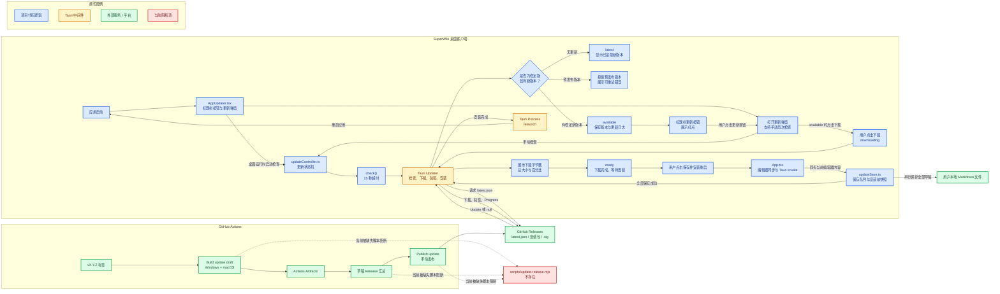
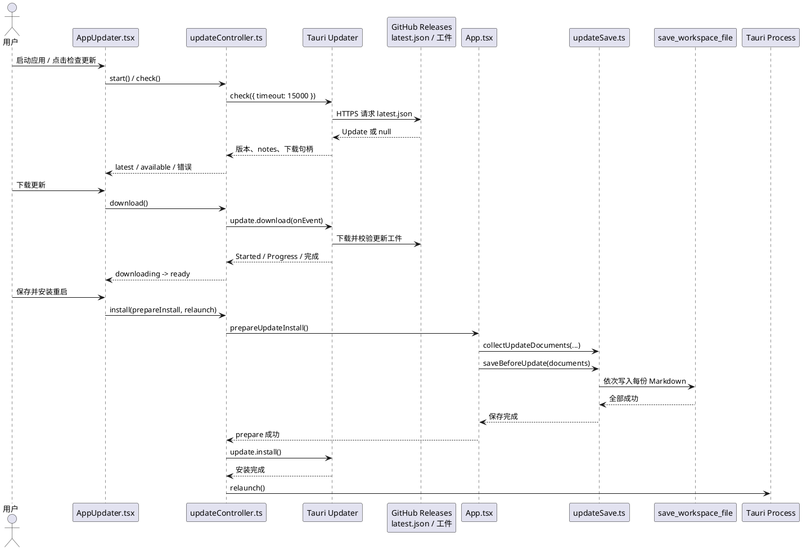
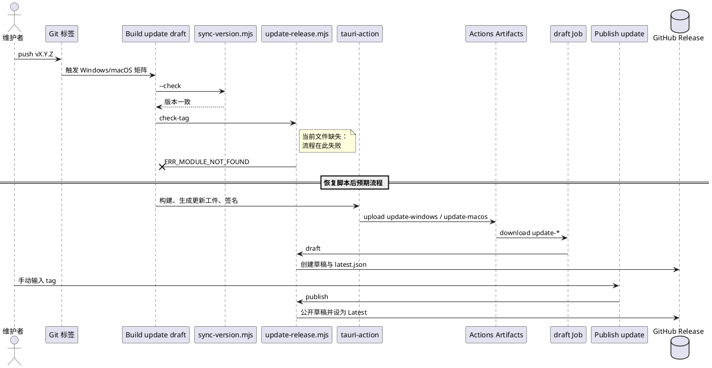

# 自动更新与 GitHub Actions 打包发布技术方案

> 设计基线：当前工作树 `0.8.3`。本文区分“已在代码中实现”“已写入工作流但未能执行”和“计划/缺失”，不将已删除的脚本描述为现有能力。

## 1. 方案概览

桌面端采用 Tauri v2 官方 Updater，而不是自建更新服务。客户端从 GitHub Releases 的静态 `latest.json` 读取稳定版本信息，使用内置公钥验证更新包签名；下载完成后，先把所有未保存的 Markdown 文档串行落盘，再调用 Updater 安装并重启。

打包流程以 Git 标签为入口：Windows 与 macOS 在 GitHub Actions 矩阵中分别构建、签名并上传临时工件，理论上随后汇总为草稿 Release，再由手动工作流公开发布。当前汇总/发布脚本 `scripts/update-release.mjs` 已缺失，所以这条 CI/CD 链路在构建前校验阶段即被阻断；客户端方案不依赖该脚本，但无法获得新的可用更新包。

### 架构图（Mermaid）

## 2. 依赖与开源组件

下表的“声明版本”来自依赖清单；“锁定版本”来自当前 `node_modules` 或 `Cargo.lock`。`^` 表示允许同一主版本内升级，因此实际构建应以锁文件为准。

| 组件 | 声明版本 | 当前锁定版本 | 引入位置 | 作用 |
| --- | --- | --- | --- | --- |
| `@tauri-apps/plugin-updater` | `^2.11.0` | `2.11.0` | `src/AppUpdater.tsx` | 调用 `check`，并在 `Update` 对象上执行下载与安装；签名校验由官方 Updater 完成。 |
| `tauri-plugin-updater` | `"2"` | `2.11.0` | `src-tauri/Cargo.toml`、`src-tauri/src/lib.rs` | Rust 端注册 Updater 插件，为前端 Updater API 提供原生实现。 |
| `@tauri-apps/plugin-process` | `^2.3.1` | `2.3.1` | `src/AppUpdater.tsx` | 安装成功后调用 `relaunch()` 重启应用。 |
| `tauri-plugin-process` | `"2"` | `2.3.1` | `src-tauri/Cargo.toml`、`src-tauri/src/lib.rs` | Rust 端启用进程重启能力。 |
| `@tauri-apps/plugin-opener` | `^2.5.5` | `2.5.5` | `src/AppUpdater.tsx` | 在系统默认浏览器打开 Release 页或更新日志链接。 |
| `tauri-plugin-opener` | `"2.5.4"` | `2.5.4` | `src-tauri/Cargo.toml`、`src-tauri/src/lib.rs` | Rust 端注册外链打开能力。前后端插件小版本不一致，但分别由各自语言生态锁定。 |
| `@tauri-apps/api` | `^2` | `2.11.1` | `src/AppUpdater.tsx`、`src/App.tsx` | 判断是否为桌面运行时、监听窗口关闭、调用 Tauri 命令。 |
| `react-markdown` | `^10.1.0` | `10.1.0` | `src/AppUpdater.tsx` | 渲染 `latest.json.notes` 中的 Markdown 更新日志。 |
| `remark-gfm` | `^4.0.1` | `4.0.1` | `src/AppUpdater.tsx` | 为更新日志提供 GFM 表格、任务列表等语法支持。 |
| `lucide-react` | `^1.28.0` | `1.28.0` | `src/AppUpdater.tsx` | 提供下载和关闭图标，不参与更新协议。 |
| `tauri-apps/tauri-action@v0` | 工作流固定为 `v0` 标签 | 未锁定到 commit SHA | `.github/workflows/build-update.yml` | 在 Windows/macOS Runner 中执行 Tauri 构建与更新产物生成。 |
| `actions/checkout@v4`、`actions/setup-node@v4`、`actions/upload-artifact@v4`、`actions/download-artifact@v4` | 工作流固定为各自主版本标签 | 未锁定到 commit SHA | 两个工作流 | 检出代码、配置 Node、跨 Job 传递构建工件。 |
| `dtolnay/rust-toolchain@stable` | `stable` 标签 | 未锁定到 commit SHA | `build-update.yml` | 安装稳定版 Rust 工具链。 |

## 3. 配置、配置项与数据存储

### 3.1 数据库和持久化状态

本功能**没有数据库、数据库表、迁移文件或更新专用的 `localStorage` 配置项**。更新状态（阶段、已下载字节、错误文本、当前 `Update` 句柄）仅保存在 `updateController.ts` 的模块内存中；应用退出后下载进度和状态都会丢失。文档保存仍复用既有 Tauri 命令 `save_workspace_file`，直接写入用户选择的本地 Markdown 文件。

### 3.2 应用依赖与版本配置

| 文件 | 字段 / 配置项 | 当前值 | 说明 |
| --- | --- | --- | --- |
| `package.json` | `version` | `0.8.3` | 前端应用版本；发布标签和其他版本文件必须一致。 |
| `package.json` | `scripts.test:updates` | `node --test tests/updates.test.mjs` | 更新控制器、保存队列及发布清单校验的 Node 测试入口。当前因缺失脚本失败。 |
| `package.json` | `dependencies.@tauri-apps/plugin-updater` | `^2.11.0` | 前端 Updater SDK。 |
| `package.json` | `dependencies.@tauri-apps/plugin-process` | `^2.3.1` | 前端重启 SDK。 |
| `package.json` | `dependencies.@tauri-apps/plugin-opener` | `^2.5.5` | 前端外链打开 SDK。 |
| `package.json` | `dependencies.react-markdown` / `remark-gfm` | `^10.1.0` / `^4.0.1` | 更新日志渲染。 |
| `src-tauri/Cargo.toml` | `[package].version` | `0.8.3` | Rust 应用版本。 |
| `src-tauri/Cargo.toml` | `tauri-plugin-updater` | `"2"` | Rust Updater 插件。 |
| `src-tauri/Cargo.toml` | `tauri-plugin-process` | `"2"` | Rust 进程重启插件。 |
| `src-tauri/Cargo.toml` | `tauri-plugin-opener` | `"2.5.4"` | Rust 外链打开插件。 |
| `src-tauri/Cargo.lock` | `tauri-plugin-updater` / `tauri-plugin-process` / `tauri-plugin-opener` | `2.11.0` / `2.3.1` / `2.5.4` | 当前可复现的 Rust 解析版本。 |
| `.agents/skills/superwiki-release/scripts/sync-version.mjs` | `--check` | 无入参以外配置 | 读取 `package.json`、`package-lock.json`、`src-tauri/tauri.conf.json`、`Cargo.toml`、`Cargo.lock`，验证均为同一 SemVer。环境变量 `SUPERWIKI_ROOT` 未设置时，以脚本相对路径推导仓库根目录。 |

### 3.3 Tauri 更新器与能力配置

| 文件 | 字段路径 | 当前值 | 说明 |
| --- | --- | --- | --- |
| `src-tauri/tauri.conf.json` | `productName` | `SuperWiki` | 打包产品名。 |
| `src-tauri/tauri.conf.json` | `version` | `0.8.3` | 与前端、Rust 包版本保持一致。 |
| `src-tauri/tauri.conf.json` | `identifier` | `com.superwiki.app` | 桌面应用标识。 |
| `src-tauri/tauri.conf.json` | `bundle.active` | `true` | 启用 Tauri bundle 输出。 |
| `src-tauri/tauri.conf.json` | `bundle.targets` | `all` | 默认可构建所有支持的 bundle；工作流以 `--bundles` 覆盖为指定格式。 |
| `src-tauri/tauri.conf.json` | `plugins.updater.endpoints` | `["https://github.com/sinceHYJ/superwiki/releases/latest/download/latest.json"]` | 更新元数据唯一来源；生产模式应使用 HTTPS。 |
| `src-tauri/tauri.conf.json` | `plugins.updater.windows.installMode` | `passive` | Windows 安装器采用被动安装 UI 模式。 |
| `src-tauri/tauri.conf.json` | `plugins.updater.pubkey` | `dW50cnVzdGVkIGNvbW1lbnQ6IG1pbmlzaWduIHB1YmxpYyBrZXk6IDMxNjlCMzA1M0IwRTQzMUYKUldRZlF3NDdCYk5wTVdpSCtKZk85T2dVYlRPbVV0cldscHdDR3NMVTJ1eEdUUlAvVWczZTQwcE8K` | Tauri updater 公钥，属于可公开分发的信任锚；配套私钥不得写入仓库。 |
| `src-tauri/tauri.release.conf.json` | `bundle.createUpdaterArtifacts` | `true` | 发布构建额外生成 Updater 所需的归档和签名工件。 |
| `src-tauri/src/lib.rs` | 插件注册 | `tauri_plugin_updater::Builder::new().build()` | 在 Tauri Builder 链中启用 Updater；同时初始化 opener 与 process 插件。 |
| `src-tauri/capabilities/default.json` | `identifier` / `windows` | `default` / `["main"]` | 更新能力只授予主窗口。 |
| `src-tauri/capabilities/default.json` | `permissions`：更新 | `updater:allow-check`、`updater:allow-download`、`updater:allow-install` | 分别允许检查、下载、安装。 |
| `src-tauri/capabilities/default.json` | `permissions`：重启 | `process:allow-restart` | 允许安装后调用 `relaunch()`。 |
| `src-tauri/capabilities/default.json` | `permissions`：外链 | `opener:allow-open-url`，白名单为 `https://*`、`http://*` | 仅允许 HTTP/HTTPS 更新日志链接与 Release 页；不允许任意 URI scheme。 |

### 3.4 前端运行时常量和状态

| 文件 | 名称 | 当前值 / 取值 | 说明 |
| --- | --- | --- | --- |
| `src/AppUpdater.tsx` | `releasePage` | `https://github.com/sinceHYJ/superwiki/releases` | “打开发布页”按钮基址；有目标版本时跳转到对应标签页。 |
| `src/AppUpdater.tsx` | `check({ timeout })` | `timeout: 15000`（毫秒） | 单次检查超时 15 秒。 |
| `src/updateController.ts` | `UpdateState.phase` | `idle`、`checking`、`latest`、`available`、`downloading`、`ready`、`installing` | 更新状态机全部阶段。初始状态为 `idle`，`downloaded: 0`，`error: ""`。 |
| `src/updateController.ts` | 预发布过滤 | `version.split("+")[0].includes("-")` | 带 prerelease 标识的版本被关闭并报错；构建元数据 `+...` 不参与判断。 |
| `src/App.tsx` | 自动保存等待 | `1000`（毫秒） | 普通自动保存的防抖时间；安装前会取消计时器并立即收集最新编辑器内容。 |

### 3.5 GitHub Actions 与机密配置

| 文件 | 字段路径 | 当前值 | 说明 |
| --- | --- | --- | --- |
| `.github/workflows/build-update.yml` | `name` | `Build update draft` | 标签构建工作流显示名称。 |
| `.github/workflows/build-update.yml` | `on.push.tags` | `["v*.*.*"]` | 推送匹配模式的标签时触发；模式本身不保证标签是稳定 SemVer，后续脚本本应校验。 |
| `.github/workflows/build-update.yml` | 顶层 `permissions.contents` | `read` | 构建 Job 只读仓库内容；`draft` Job 覆盖为 `write`。 |
| `.github/workflows/build-update.yml` | `concurrency.group` / `cancel-in-progress` | `update-${{ github.ref_name }}` / `false` | 同一标签的工作流避免并发写同一 Release，并让已开始的执行不被取消。 |
| `.github/workflows/build-update.yml` | `jobs.build.strategy.fail-fast` | `false` | 一个矩阵失败时另一平台仍继续，便于收集诊断结果。 |
| `.github/workflows/build-update.yml` | Windows 矩阵 | `windows-latest`、`x86_64-pc-windows-msvc`、`nsis,msi` | 生成 Windows x64 的 NSIS 和 MSI。 |
| `.github/workflows/build-update.yml` | macOS 矩阵 | `macos-latest`、`universal-apple-darwin`、`app,dmg` | 生成 Universal macOS App/DMG，并额外安装 `aarch64-apple-darwin` 与 `x86_64-apple-darwin` 目标。 |
| `.github/workflows/build-update.yml` | Node / Rust Action | `actions/setup-node@v4` + `node-version: '24'`；`dtolnay/rust-toolchain@stable` | CI 构建环境。 |
| `.github/workflows/build-update.yml` | 构建前命令 | `npm ci`；`node .agents/skills/superwiki-release/scripts/sync-version.mjs --check`；`node scripts/update-release.mjs check-tag`；`npm run test:updates` | 安装依赖、校验版本、校验标签、运行测试。第三项引用不存在的文件，导致后续命令不会执行。 |
| `.github/workflows/build-update.yml` | `tauri-action` | `tauri-apps/tauri-action@v0` | 仅构建，不创建或上传 Release。使用浮动标签而非 commit SHA。 |
| `.github/workflows/build-update.yml` | `tauri-action.with.includeUpdaterJson` | `false` | 禁用 Action 自动生成/上传 `latest.json`，设计上交给汇总脚本统一生成。 |
| `.github/workflows/build-update.yml` | `tauri-action.with.args` | `--target ${{ matrix.target }} --bundles ${{ matrix.bundles }} --config src-tauri/tauri.release.conf.json` | 按矩阵构建，并叠加生成更新工件的配置。 |
| `.github/workflows/build-update.yml` | `NODE_OPTIONS` | `--max-old-space-size=4096` | Node 堆上限 4 GiB。 |
| `.github/workflows/build-update.yml` | `TAURI_SIGNING_PRIVATE_KEY` | `${{ secrets.TAURI_SIGNING_PRIVATE_KEY }}` | 必填机密；工作树与日志均不能读取其真实值，必须与 `pubkey` 匹配。 |
| `.github/workflows/build-update.yml` | `TAURI_SIGNING_PRIVATE_KEY_PASSWORD` | `${{ secrets.TAURI_SIGNING_PRIVATE_KEY_PASSWORD }}` | 可选机密；若私钥加密则必须设置。当前是否在 GitHub 仓库设置无法由本地代码验证。 |
| `.github/workflows/build-update.yml` | Apple 相关变量 | `APPLE_CERTIFICATE`、`APPLE_CERTIFICATE_PASSWORD`、`APPLE_SIGNING_IDENTITY`、`APPLE_ID`、`APPLE_PASSWORD`、`APPLE_TEAM_ID` 全部为注释行 | 未注入 Runner，因此未启用 macOS 代码签名/公证。 |
| `.github/workflows/build-update.yml` | 上传工件 | 名称 `update-${{ matrix.os }}`；路径为 `**/*.exe`、`**/*.msi`、`**/*.dmg`、`**/*.app.tar.gz`、`**/*.sig`；`if-no-files-found: error` | 将两个构建 Job 的产物交给草稿 Job；缺任一匹配文件即失败。 |
| `.github/workflows/build-update.yml` | `jobs.draft` | `needs: build`、`ubuntu-latest`、`contents: write` | 仅在两个构建都成功后下载 `update-*` 工件，并调用缺失脚本的 `draft` 子命令。 |
| `.github/workflows/build-update.yml` | `jobs.draft.env.GH_TOKEN` | `${{ github.token }}` | GitHub 自动提供的临时 Token，用于创建草稿 Release；实际值不应记录或输出。 |
| `.github/workflows/publish-update.yml` | `name` / `on` | `Publish update` / `workflow_dispatch` | 仅可从 Actions UI 或 API 手动触发。 |
| `.github/workflows/publish-update.yml` | `inputs.tag` | 必填 `string`；说明示例 `v0.8.0` | 操作者指定已填写更新日志的草稿标签。 |
| `.github/workflows/publish-update.yml` | `permissions.contents` | `write` | 允许修改 Release。 |
| `.github/workflows/publish-update.yml` | `concurrency.group` / `cancel-in-progress` | `update-${{ inputs.tag }}` / `false` | 与同标签构建互斥。 |
| `.github/workflows/publish-update.yml` | 发布命令及环境 | `node scripts/update-release.mjs publish`；`GH_TOKEN=${{ github.token }}`；`UPDATE_TAG=${{ inputs.tag }}` | 目标是公开草稿；因为脚本不存在，当前 Job 必定失败。 |

`latest.json` 是客户端请求的更新元数据，但当前工作树没有生成该文件的实现，也不存在可校验的字段实例。不能据此断言其实际 `version`、`notes`、`pub_date`、`platforms`、下载 URL 或签名值。恢复发布脚本后，应基于 Tauri 官方 manifest 格式重新记录最终字段。

## 4. 流程、算法与模块调用

### 4.1 改动模块及职责

| 模块 | 文件 | 职责 |
| --- | --- | --- |
| 更新 UI | `src/AppUpdater.tsx`、`src/AppUpdater.css` | 标题栏入口、弹窗、版本与更新日志展示、进度、错误、下载/安装按钮。 |
| 更新状态机 | `src/updateController.ts` | 去重检查、稳定版过滤、下载进度累加、安装状态控制与错误回退。 |
| 安装前保存 | `src/updateSave.ts` | 收集草稿，并用 Promise 队列保证旧写入先完成。 |
| 应用集成 | `src/App.tsx` | 连接编辑器即时同步、Tauri `save_workspace_file`、文档切换拦截和 UI 组件。 |
| 原生能力 | `src-tauri/src/lib.rs`、`src-tauri/capabilities/default.json` | 注册 Updater/Process/Opener 插件并限制前端权限。 |
| 发布构建 | `.github/workflows/build-update.yml`、`.github/workflows/publish-update.yml`、`src-tauri/tauri.release.conf.json` | 双平台构建、签名工件、草稿汇总与手动发布的工作流定义。 |
| 测试 | `tests/updates.test.mjs` | 覆盖状态机、保存序列和原本应由发布脚本导出的校验函数。 |

### 4.2 关键函数和伪代码

本次没有新增函数。下表列出当前实现中与自动更新直接相关的方法；参数类型为源码中的真实类型或等价描述。

| 文件:方法 | 参数 | 逻辑 |
| --- | --- | --- |
| `src/AppUpdater.tsx:AppUpdater` | `{ currentVersion: string; prepareInstall: () => Promise<void>; finishInstall: () => void; onOpenChange: (open: boolean) => void }` | 在桌面运行时启动一次检查；渲染红点和弹窗；将下载、安装操作委托给状态机。 |
| `src/AppUpdater.tsx:openDialog` | 无 | 打开原生 `<dialog>`，清空外链错误，并触发一次手动检查。 |
| `src/AppUpdater.tsx:openLink` | `url: string` | 仅接受 `http:` / `https:` URL；通过 Opener 打开，失败则写入 `linkError`。 |
| `src/updateController.ts:createUpdateController` | `check: () => Promise<PendingUpdate \| null>` | 创建模块级状态、订阅集合和单个 `Update` 句柄，返回更新操作接口。 |
| `src/updateController.ts:start` | 无 | 用 `started` 布尔值保证一次应用生命周期内只发起一次启动检查。 |
| `src/updateController.ts:check` | 无 | 忽略检查/下载/准备安装/安装中的重复调用；请求更新，拒绝预发布，替换旧句柄，更新为 `latest` 或 `available`。 |
| `src/updateController.ts:download` | 无 | 仅在 `available` 状态下载；接收 `Started` 与 `Progress` 事件，累计字节数；成功转 `ready`，失败回退 `available`。 |
| `src/updateController.ts:install` | `prepare: () => Promise<void>`，`restart: () => Promise<void>` | 仅在 `ready` 状态执行：先保存，再 `update.install()`，最后重启；任一步失败转回 `ready` 以支持重试。 |
| `src/updateSave.ts:collectUpdateDocuments` | `tabs: DocumentFile[]`，`drafts: Record<string, string>`，`active: DocumentFile \| null`，`latest: string` | 将非活动页草稿与当前页即时编辑器内容转换为待写入文档；遇到无法定位的草稿直接失败，避免静默丢失。 |
| `src/updateSave.ts:createSaveQueue` | `write: (document: UpdateDocument) => Promise<void>` | 返回串行写队列：普通写入挂到 `pending` 后；安装前写入先等待已在途任务，再逐项写入。 |
| `src/updateSave.ts:saveBeforeUpdate` | `documents: UpdateDocument[]` | 伪代码：`await pending; for (document of documents) await write(document)`；任何一项失败立即中断，不进入安装。 |
| `src/App.tsx:prepareUpdateInstall` | 无 | 禁止正在切换文件时安装；取消自动保存定时器；同步编辑器；收集草稿并调用 `saveBeforeUpdate`；失败时恢复草稿和错误状态。 |
| `scripts/update-release.mjs:check-tag` | 工作流命令行子命令 | **文件不存在，无法审查实现。**工作流意图是在 Tauri 构建前验证稳定标签。 |
| `scripts/update-release.mjs:draft` | 工作流命令行子命令 | **文件不存在，无法审查实现。**工作流意图是汇总工件并创建草稿 Release。 |
| `scripts/update-release.mjs:publish` | 工作流命令行子命令；环境变量 `UPDATE_TAG` | **文件不存在，无法审查实现。**工作流意图是校验草稿并公开发布。 |
| `scripts/update-release.mjs:stableVersion`、`validateManifest` | 测试期望的 `(tag)`、`(manifest, tag, assetNames)` | `tests/updates.test.mjs` 仍在导入这两个函数，但目标文件缺失；仅能确认测试期望存在，不能把其逻辑当成现有实现。 |

### 4.3 客户端调用图（PlantUML）

### 4.4 发布调用图（PlantUML）

## 5. 技术决策与 Trade-off

| 决策 | 选择原因 | 优势 | 代价 / 风险 |
| --- | --- | --- | --- |
| 使用 Tauri 官方 Updater + GitHub Releases | 项目是本地桌面应用，无独立更新服务和数据库；Tauri 已提供签名校验和平台安装机制。 | 无需维护服务器；更新包可验签；前后端 API 与 Tauri v2 一致。 | 依赖 GitHub 可访问性；没有私有更新渠道、灰度或镜像回退。 |
| 将下载与安装拆为两步 | 必须在安装前先保存所有编辑器草稿。 | 下载过程可在弹窗关闭后继续；可显示进度；避免安装覆盖未保存内容。 | 状态机更多，退出后不能断点续传。 |
| 安装前使用串行保存队列 | 自动保存可能已经在运行，直接并发写会使旧内容覆盖最后快照。 | 保证旧写入完成后再写入安装快照，任何失败均阻止安装。 | 文档多或磁盘慢时安装等待变长；任一文件失败会阻断全部更新。 |
| 启动只检查一次，支持手动检查 | 避免重复请求和组件重新挂载导致的重复弹窗。 | 行为可预测、网络消耗低。 | 不轮询；用户需手动检查才能在运行期间发现随后发布的版本。 |
| 只允许稳定版 | 正式用户不应被错误发布的 beta/rc 更新。 | 降低误升级风险。 | 无法通过当前渠道测试预发布版本或实现测试频道。 |
| Windows 使用 `passive` 安装模式 | 在默认安装器体验与较少交互之间折中。 | 安装步骤相对简洁。 | 仍可能显示安装器 UI；需要在真实 Windows 机器验收。 |
| macOS 使用 Universal 构建 | 一个更新归档覆盖 Intel 和 Apple Silicon。 | Release 资产更少，客户端平台匹配更简单。 | macOS 构建耗时与 Runner 成本更高；未完成 Apple 签名/公证。 |
| 构建和发布拆分 | 先让维护者审阅草稿与更新日志，再公开。 | 降低错误标签或不完整资产直接发布的概率；避免矩阵并行写同一 Release。 | 操作多一步；依赖汇总脚本正确存在。 |
| 禁用 `tauri-action` 自动 `latest.json` | 设计上由单一汇总阶段生成 manifest，避免矩阵并行写同一 `latest.json` 的竞态。 | 将 Release 资产和 manifest 校验集中。 | 自定义汇总脚本成为关键单点；当前该脚本缺失，发布链路完全不可用。 |

## 6. 当前 Debug、缺陷与限制

### 已确认的阻断缺陷

1. **`scripts/update-release.mjs` 被删除但工作流和测试仍引用它。**Git 历史显示该文件在提交 `66393a2`（`chore: 删除旧构建与发布脚本`）被删除；当前 `build-update.yml` 的 `check-tag`、`draft`，`publish-update.yml` 的 `publish` 以及 `tests/updates.test.mjs` 的导入均依赖它。
2. **可复现结果：**运行 `npm run test:updates` 会报 `ERR_MODULE_NOT_FOUND`，定位到 `scripts/update-release.mjs`。标签工作流也会在执行 `node scripts/update-release.mjs check-tag` 时失败，尚未进入 Tauri 打包步骤。
3. **修复方向：**从删除前的受审版本恢复该脚本，或重新实现并补足 `check-tag`、`draft`、`publish`、`stableVersion`、`validateManifest`。恢复后先运行 `npm run test:updates`，再用非生产标签在 GitHub Actions 验证双平台工件和草稿流程；在脚本恢复前不应推送发布标签。

### 其他限制与风险

| 项目 | 现状与影响 | 建议 |
| --- | --- | --- |
| macOS 代码签名与公证 | Apple 相关 Secrets 在工作流中被注释，Gatekeeper 行为未纳入 CI。更新包签名不等于 Apple 代码签名/公证。 | 配置证书、签名身份和公证凭据后，在 Intel 与 Apple Silicon 真实设备验收。 |
| 端到端验签 | 单元测试只能模拟下载/签名失败分支；当前没有已验证的真实 Release 更新测试。 | 脚本恢复后用较低正式版本分别在 Windows/macOS 验证下载、验签、安装与重启。 |
| Action 供应链可复现性 | 所有 Actions 使用主版本/`stable` 浮动标签，而不是 commit SHA。 | 发布链路稳定后，将第三方 Action 固定到受信任 commit SHA，并设定更新策略。 |
| GitHub 网络依赖 | 更新源和下载资产均指向公开 GitHub；断网、限流、区域网络问题会导致检查或下载失败。 | 保留当前错误与重试入口；如需企业级可用性，再评估镜像/自建更新源。 |
| 无下载续传 | 更新进度仅存在进程内存，退出后从头开始下载。 | 若安装包较大，再评估官方 API 支持范围或引入受控缓存；当前未实现。 |
| 无 beta/灰度渠道 | 客户端拒绝带 `-` 的版本，并只读取 Latest Release。 | 若需内测，增加独立 endpoint/渠道配置，不应放宽稳定版过滤后直接面向正式用户。 |
| 更新元数据不可审计 | 生成 `latest.json` 的脚本缺失，最终 manifest 字段、资产选择和签名关联无法复核。 | 恢复脚本并为生成 manifest 增加 fixture 测试与 Release 资产校验。 |

## 7. 参考

- [Tauri v2 Updater：配置、签名、`createUpdaterArtifacts` 与 GitHub 静态更新源](https://v2.tauri.app/plugin/updater/)
- [Tauri Updater JavaScript API：`check`、`download`、`install` 与进度事件](https://v2.tauri.app/reference/javascript/updater/)
- [Tauri 官方 GitHub Action：构建、更新资产和 Release 参数](https://github.com/tauri-apps/tauri-action)
- [Tauri Action 变更记录：`includeUpdaterJson` 更名与 Universal macOS 行为](https://github.com/tauri-apps/tauri-action/blob/dev/CHANGELOG.md)
- [GitHub Actions 工作流语法与权限、机密引用](https://docs.github.com/en/actions/reference/workflows-and-actions/workflow-syntax)
- [GitHub Actions Artifacts：跨 Job 上传和下载构建资产](https://docs.github.com/en/actions/concepts/workflows-and-actions/workflow-artifacts)
- [GitHub Actions 并发控制](https://docs.github.com/en/actions/concepts/workflows-and-actions/concurrency)
- [GitHub Actions Secrets 安全参考](https://docs.github.com/en/actions/reference/security/secrets)
