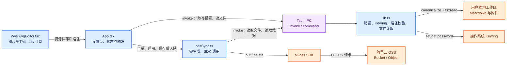
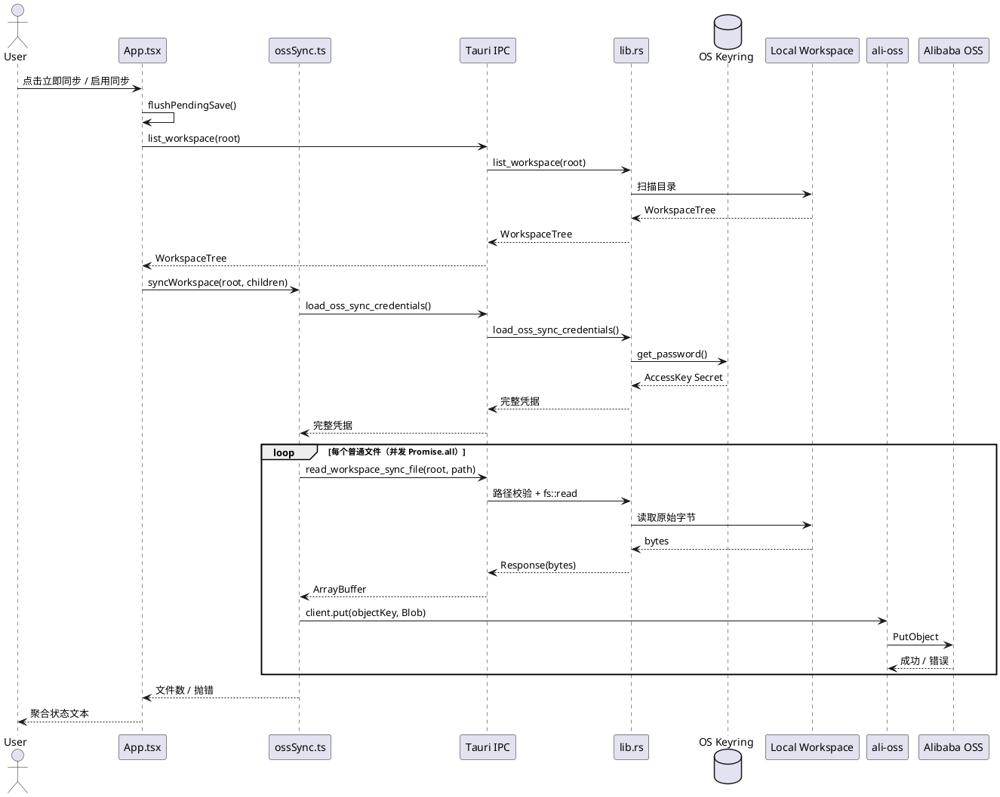
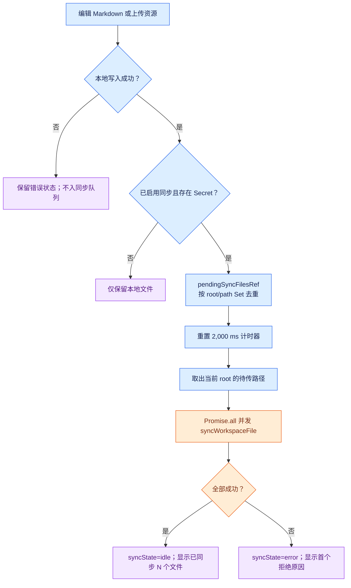

# OSS 单向同步技术设计

Version: 1.0

> 核对基线：SuperWiki `0.8.3`。本文描述当前工作树已经存在的实现和由此得出的风险，不是待开发功能的承诺。这里的“同步”是本地工作区到阿里云 OSS 的单向上传；本地工作区是事实来源。

## 1. 设计目标、边界与结论

**目标**：用户配置并启用 OSS 后，可手动全量上传当前工作区；本地 Markdown 成功保存、图片或 HTML 资源成功上传后，可延迟上传对应文件。

**非目标**：远端拉取、双向同步、冲突合并、删除传播、远端浏览、版本历史、离线可靠投递和账号协作均未实现。

**结论**：技术上这是“可选的对象存储上传通道”，不是多端一致性系统。OSS 同对象键的 `PutObject` 默认覆盖旧对象，且当前没有版本/哈希/锁协调，因此不能把它宣传为无冲突备份或跨设备同步。[OSS PutObject 文档](https://www.alibabacloud.com/help/en/oss/developer-reference/putobject)

## 2. 依赖与开源包

下表只列同步直接使用或为其新增的依赖；Tauri、React、Serde 等应用基础依赖虽参与调用链，但并非同步专用新增包。

| 生态 | 包与锁定版本 | 声明位置 | 作用 | 当前使用点 |
| --- | --- | --- | --- | --- |
| npm | [`ali-oss` `^6.23.0`](https://github.com/ali-sdk/ali-oss)；锁定 `6.23.0` | `package.json`、`package-lock.json` | 阿里云 OSS JavaScript SDK；创建客户端并执行 `put` / `delete` | `src/ossSync.ts` 的 `createClient`、`testOssSyncConnection`、`syncWorkspace`、`syncWorkspaceFile` |
| npm | [`@types/ali-oss` `^6.23.3`](https://www.npmjs.com/package/@types/ali-oss)；锁定 `6.23.3` | `package.json`、`package-lock.json` | `ali-oss` 的 TypeScript 声明，提供编译期类型检查；无运行时逻辑 | `src/ossSync.ts` 的 `import OSS` 类型推导 |
| Cargo | [`keyring` `3`](https://docs.rs/keyring/3.6.3/keyring/)；锁定 `3.6.3`，特性 `windows-native` | `src-tauri/Cargo.toml`、`src-tauri/Cargo.lock` | 调用系统凭据库保存、读取 AccessKey Secret，避免把 Secret 写入 JSON | `src-tauri/src/lib.rs` 的 `oss_sync_secret_entry`、保存/读取配置命令 |

同步调用链复用了以下既有基础设施，并未为同步额外引入 HTTP 服务、中间件进程、数据库驱动或 Tauri 插件：

- `@tauri-apps/api/core` 的 `invoke` 将 WebView 调用路由到 Rust `#[tauri::command]`；命令注册模式见 [Tauri 官方文档](https://v2.tauri.app/develop/calling-rust/)。
- Rust `std::fs` 负责规范化本地路径和读取文件字节，`serde` / `serde_json` 序列化 `oss-sync.json`；[Serde 文档](https://serde.rs/)。
- 浏览器原生 `Blob` 包装 IPC 返回的文件字节后交给 SDK；[MDN Blob 文档](https://developer.mozilla.org/docs/Web/API/Blob)。

## 3. 配置、数据与持久化

### 3.1 配置文件、密钥和数据库

| 存储位置 / 对象 | 是否同步专用 | 字段或内容 | 实际值、默认值与规则 |
| --- | --- | --- | --- |
| 应用配置目录 `oss-sync.json` | 是 | `region` | 用户填写字符串，保存时 `trim()`；不能为空。设置页提示值：`oss-cn-hangzhou`。 |
| 同上 | 是 | `endpoint` | 用户填写字符串，保存时 `trim()` 并去掉末尾 `/`；为空报错；无协议时自动加 `https://`；显式协议仅接受 `http://` 或 `https://`。提示值：`https://oss-cn-hangzhou.aliyuncs.com`。 |
| 同上 | 是 | `bucket` | 用户填写字符串，保存时 `trim()`；不能为空。提示值：`my-superwiki-backup`。 |
| 同上 | 是 | `prefix` | 用户填写字符串；去掉首尾 `/`，反斜杠转 `/`，任一 `..` 段报错。前端空表单默认值为 `superwiki`。允许空字符串，表示对象键不加前缀。 |
| 同上 | 是 | `accessKeyId` | 用户填写字符串，保存时 `trim()`；不能为空。 |
| 同上 | 是 | `enabled` | 布尔值；新字段反序列化缺失时为 `false`，表示兼容旧配置时默认关闭。 |
| 系统 Keyring | 是 | 服务名 | 固定为 `com.superwiki.app`。 |
| 系统 Keyring | 是 | 账户名 | 固定为 `oss-access-key-secret`。 |
| 系统 Keyring | 是 | 密钥值 | `accessKeySecret` 明文值；不写入 `oss-sync.json`、`localStorage` 和应用状态持久化。表单空值只保留已有 Keyring 值；若 Keyring 中不存在值则保存失败。 |
| React 内存 | 是 | `ossSyncSettings` | Rust 返回的非 Secret 设置加 `hasAccessKeySecret`，用于决定是否允许自动上传。关闭/退出即丢失，可由上述两处存储重新加载。 |
| React 内存 | 是 | `ossSyncForm` | 设置表单草稿，初始 `prefix` 为 `superwiki`，其余字符串为空；不持久化。 |
| React 内存 | 是 | `syncState` | 枚举：`idle`、`syncing`、`error`；只驱动 UI。 |
| React 内存 | 是 | `syncMessage` | 当前聚合状态或错误文本；只驱动 UI。 |
| React 内存 | 是 | `syncTimerRef` | 单个 2,000 ms 自动上传去抖计时器；退出前会清除。 |
| React 内存 | 是 | `pendingSyncFilesRef` | `Map<root, Set<path>>`，按工作区和路径去重的待传文件集合；没有落盘。 |
| 用户工作区 | 否，作为源数据 | 全部既有普通文件 | 全量同步读取目录树中的所有非目录条目，以原始字节上传。Markdown、图片、HTML、Office 和其他普通文件均可能进入上传集。 |
| OSS Bucket | 外部服务 | 对象键 | `prefix` 与 `path.slice(root.length)` 得到的工作区相对路径以 `/` 拼接。例如 `prefix=superwiki`、本地 `/notes/a.md`、根 `/notes` 时为 `superwiki/a.md`。 |
| 数据库 | 不存在 | 表 / 迁移 / 索引 | 项目没有数据库、同步表或 schema migration。 |
| `localStorage` | 不使用 | 同步配置 / 同步队列 | 不存在；其中的 `superwiki.autoSave` 只是影响保存流程，从而间接影响增量上传。 |
| `src-tauri/capabilities/default.json` | 未新增同步项 | capability | 没有 OSS 专用 capability；同步使用应用已允许的 Tauri IPC 命令和 WebView 网络栈。 |

`oss-sync.json` 的逻辑结构如下。下例仅展示字段形状，**不是可用凭据**：

```json
{
  "region": "oss-cn-hangzhou",
  "endpoint": "https://oss-cn-hangzhou.aliyuncs.com",
  "bucket": "my-superwiki-backup",
  "prefix": "superwiki",
  "accessKeyId": "用户填写的 AccessKey ID",
  "enabled": false
}
```

### 3.2 传输与权限前提

1. SDK 构造参数固定包含 `secure: true` 与 `authorizationV4: true`；Endpoint 可被用户明确填为 `http://`，因此“默认 HTTPS”不等于“配置层强制 HTTPS”。
2. 测试连接执行一次 `put` 再 `delete`，所以凭据至少需要测试对象路径的 `oss:PutObject` 和 `oss:DeleteObject`；增量与全量上传至少需要目标前缀的 `oss:PutObject`。OSS 的权限模型与 `PutObject` 所需动作见 [官方 API 文档](https://www.alibabacloud.com/help/en/oss/developer-reference/putobject)。
3. 没有为 Bucket 自动配置 CORS、RAM Policy、Bucket Policy、生命周期或版本控制。这些是用户的云侧运维配置，不属于本地 `oss-sync.json`。

## 4. 架构

图例：蓝色为项目代码逻辑，橙色为外部依赖/服务，紫色为进程间或系统中间层。



说明：Tauri IPC 在此按“中间层”着色，仅表示 WebView 与 Rust 的跨进程调用边界；本项目没有独立消息队列、缓存、数据库或服务端中间件。

## 5. 模块、方法与流程算法

### 5.1 涉及模块

| 模块 | 当前职责 | 同步中的改动/耦合点 |
| --- | --- | --- |
| `src/ossSync.ts` | OSS SDK 适配层 | 创建客户端、生成对象键、枚举文件、测试连接、全量与单文件上传。 |
| `src/App.tsx` | 前端编排层 | 管理表单、加载与保存设置、启用首次全量上传、手动同步、2 秒去抖增量队列及状态提示。 |
| `src/WysiwygEditor.tsx` | 编辑器资源上传 | 图片/HTML 上传成功后上报资源相对路径，触发 `App.tsx` 入队。 |
| `src/workspaceImages.ts`、`src/workspaceHtml.ts` | 资源上传 IPC 封装 | 将 File 的字节和元数据传给 Rust；返回保存后的相对路径。 |
| `src-tauri/src/lib.rs` | 信任边界与本地能力 | 规范化配置、访问 Keyring、校验工作区文件、返回同步所需原始字节、注册命令。 |
| `package.json`、`src-tauri/Cargo.toml` | 依赖声明 | 声明 `ali-oss` / 类型包以及 `keyring`。 |

### 5.2 核心函数与伪代码

| 文件:方法 | 参数 → 返回 | 核心逻辑 |
| --- | --- | --- |
| `src/ossSync.ts:createClient` | `credentials: OssSyncCredentials` → `OSS` | 使用区域、Endpoint、Bucket、AccessKey ID/Secret 创建 SDK 客户端，开启 `secure` 和 V4 签名。 |
| `src/ossSync.ts:remoteObjectKey` | `prefix, root, path: string` → `string` | 从绝对 `path` 截取 `root` 前缀，去路径分隔符并统一为 `/`，再与修剪后的 `prefix` 拼接。 |
| `src/ossSync.ts:collectFiles` | `nodes: WorkspaceFile[]` → `string[]` | 深度优先递归，收集所有 `isDir === false` 的路径。 |
| `src/ossSync.ts:getClient` | 无参 → `{ client, credentials }` | `invoke("load_oss_sync_credentials")` 获取运行时凭据，随后建客户端。 |
| `src/ossSync.ts:testOssSyncConnection` | 无参 → `Promise<void>` | 拼接前缀与 UUID 测试键，依次执行 `put` 和 `delete`。 |
| `src/ossSync.ts:syncWorkspace` | `root, nodes` → `Promise<number>` | 读取一次凭据；枚举全部文件；对每个文件 `invoke("read_workspace_sync_file")`，将字节包装为 `Blob` 后 `client.put(objectKey, blob)`；`Promise.all` 成功时返回文件数。 |
| `src/ossSync.ts:syncWorkspaceFile` | `root, path` → `Promise<void>` | 每次调用读取凭据、读取单个文件字节并上传。 |
| `src/App.tsx:queueWorkspaceFileSync` | `root, path` → `void` | 同步启用且 Secret 存在才入 `Map<root, Set<path>>`；重置全局 2 秒计时器；超时后并发调用所有 `syncWorkspaceFile`。 |
| `src/App.tsx:flushPendingSave` | `force = false` → `Promise<void>` | 清除本地保存定时器；自动保存关闭且非强制时直接返回；否则同步编辑器内容并通过保存队列落盘，成功后调用增量入队。 |
| `src/App.tsx:syncCurrentWorkspace` | 无参 → `Promise<void>` | 需要工作区；必要时先保存表单；调用 `flushPendingSave()`，刷新目录树，调用 `syncWorkspace` 全量上传。 |
| `src/App.tsx:changeOssSyncEnabled` | `enabled: boolean` → `Promise<void>` | 关闭时仅保存 `enabled=false`；开启时要求工作区、保存设置、调用 `flushPendingSave()` 后全量上传。 |
| `src/App.tsx:handleAssetUploaded` | `source?: string` → `void` | 将资源相对路径解析为绝对工作区路径并入队；随后刷新目录树。 |
| `src-tauri/src/lib.rs:read_workspace_sync_file` | `root, path: String` → `Response` | 经 `workspace_file_path` 规范化并校验后，`fs::read` 返回原始字节。 |
| `src-tauri/src/lib.rs:save_oss_sync_settings` | `app, settings` → `Result<(), String>` | 规范化与校验各字段；若传入非空 Secret 则写 Keyring；序列化非密钥字段并写 `oss-sync.json`。 |
| `src-tauri/src/lib.rs:load_oss_sync_credentials` | `app` → `OssSyncCredentials` | 读取、规范化并验证 JSON；从 Keyring 读取 Secret；组合为仅运行时使用的完整凭据。 |

全量同步的等价伪代码：

```ts
async function syncWorkspace(root: string, nodes: WorkspaceFile[]) {
  const { client, credentials } = await getClient();
  const paths = collectFiles(nodes);

  await Promise.all(paths.map(async (path) => {
    const bytes = await invoke<ArrayBuffer>("read_workspace_sync_file", { root, path });
    const objectKey = remoteObjectKey(credentials.prefix, root, path);
    await client.put(objectKey, new Blob([bytes]));
  }));

  return paths.length;
}
```

### 5.3 调用图



### 5.4 增量上传流程

核心关键点是“**本地持久化成功后再入队**”：普通 Markdown 只有 `save_workspace_file` 成功后才调用 `queueWorkspaceFileSync`；资源文件在 Rust 成功写入 `assets/` 后由编辑器回调入队。这样避免上传一个尚未落盘的 Markdown 版本，但不提供持久重试保证。



## 6. 决策与 Trade-off

| 技术选择 | 为什么这样选择 | 优势 | 代价 / 不足 |
| --- | --- | --- | --- |
| 单向 `PutObject`，不下载 | 本地优先应用没有远端事实来源与冲突模型 | 实现短、不会主动覆盖本地文件 | 不能实现多端编辑或恢复；远端只是上传副本 |
| 前端使用 `ali-oss` | UI 已持有同步状态，SDK 可直接处理浏览器 `Blob` | 调用链直接，少一层 Rust 网络封装 | Secret 必须进入 WebView 内存；需考虑 WebView 网络/CORS 与 SDK 兼容性 |
| Rust 读取本地文件 | 前端不直接访问本地文件系统，保持 Tauri 边界 | 可集中做 canonicalize、根目录与普通文件校验 | IPC 搬运整个文件字节；大文件有内存复制成本 |
| Keyring 存 Secret、JSON 存其余配置 | 兼顾持久化和避免明文配置泄漏 | Secret 不进入 Git、JSON 和 `localStorage` | Keyring 与 JSON 是两个独立存储，无法原子提交；跨平台行为需要验证 |
| `Promise.all` 全并发上传 | 最小实现下代码简单、少量文件完成快 | 小工作区吞吐高 | 无并发上限、无单文件进度；大目录会造成请求和内存突发 |
| 2 秒去抖 + `Set` 去重 | 降低连续编辑引起的重复上传 | 少量代码即可合并高频保存 | 队列不持久，退出/崩溃/断网时会丢；单个全局计时器不适合复杂多工作区 |
| `prefix + 相对路径` 作为对象键 | 保留用户工作区目录结构，用户可选择远端命名空间 | 可读、无需额外清单数据库 | 多工作区共用 Bucket/prefix 时，同路径会互相覆盖 |

## 7. 已知 Bug 与限制

### P0：应优先修复

1. **关闭自动保存会导致“立即同步 / 首次启用”上传旧内容。** `syncCurrentWorkspace` 与启用分支调用 `flushPendingSave()` 时没有传 `true`；而 `flushPendingSave` 在 `autoSave === false` 时会直接返回。因此编辑器当前未落盘的 Markdown 不会被全量同步。修复方向：这些显式同步入口应调用 `flushPendingSave(true)`，并在保存失败时中止全量上传。
2. **全量与增量上传存在同键写入竞态。** 两类任务没有同工作区互斥或版本判断。全量任务读取旧字节后，增量任务可能先上传新字节，随后旧全量任务完成上传并把远端回退。修复方向：按工作区串行化任务、给路径合并版本号或保存时序，并在上传前重新读取/比对版本。
3. **同步队列不持久且无重试。** 2 秒窗口内退出、网络失败或应用崩溃后，待上传任务直接丢失；失败只展示错误。修复方向：将任务与重试元数据持久化，启动时恢复，并实现指数退避和用户可见重试。

### P1：当前限制和可观察缺陷

1. **失败并非事务性。** `Promise.all` 的一个任务失败会使界面立即进入错误态，但其他已经发起的上传仍可能成功；没有成功/失败清单，用户无法判断远端处于何种部分完成状态。
2. **删除、新建和重命名没有远端语义。** 本地删除或重命名不删除/移动远端对象；新建但从未保存的空 Markdown 是否上传取决于后续全量同步。久而久之会产生远端孤儿对象。
3. **对象键可能跨工作区碰撞。** 默认 `prefix=superwiki`，不同工作区若共用 Bucket 与前缀，`README.md` 等同路径会覆盖。应默认生成稳定工作区命名空间或在 UI 中明确警告。
4. **无差异判断和文件大小保护。** 每次全量同步都读取并上传所有文件；无 ETag、Content-MD5、mtime、哈希、大小阈值、忽略规则、断点续传或并发上限。成本、内存和请求数会随工作区规模线性增长并可能突发。
5. **测试连接可能遗留对象。** 临时对象的 `put` 成功、`delete` 失败时会留在 Bucket；错误消息没有给出可清理对象键。
6. **测试连接比实际上传需要更高权限。** 实际单向上传只需 `oss:PutObject`，但测试连接还要求删除权限，可能出现“真实上传可行但测试失败”的误判。
7. **Secret 仍会进入前端运行时。** Keyring 保护的是静态存储，不保护 WebView 中创建 SDK 时的内存暴露面；应限制 RAM 权限、考虑 STS，并评估将 OSS 客户端移入 Rust 的成本。
8. **配置协议约束不一致。** 客户端指定 `secure: true`，但 Rust 仍接受用户填入 `http://` Endpoint。若安全目标是强制 TLS，应在 `normalize_oss_endpoint` 中拒绝 HTTP，而不是仅依赖 SDK 参数。
9. **配置写入可部分成功。** 先更新 Keyring 后写 `oss-sync.json`；后者失败会留下已更新的 Secret 与旧配置的组合。需要补偿、脏状态标记或下次启动修复机制。

## 8. 参考

### 代码定位

- [OSS SDK 适配层：`src/ossSync.ts`](/Users/administrator/cp/project/superwiki/src/ossSync.ts)
- [前端同步编排：`src/App.tsx`](/Users/administrator/cp/project/superwiki/src/App.tsx)
- [Rust 配置、Keyring 与文件读取：`src-tauri/src/lib.rs`](/Users/administrator/cp/project/superwiki/src-tauri/src/lib.rs)
- [npm 依赖：`package.json`](/Users/administrator/cp/project/superwiki/package.json)
- [Cargo 依赖：`src-tauri/Cargo.toml`](/Users/administrator/cp/project/superwiki/src-tauri/Cargo.toml)
- [同步产品规格：`docs/specs/sync/spec.MD`](/Users/administrator/cp/project/superwiki/docs/specs/sync/spec.MD)

### 外部官方资料

- [ali-oss GitHub 仓库与 SDK 用法](https://github.com/ali-sdk/ali-oss)
- [ali-oss npm 包信息](https://www.npmjs.com/package/ali-oss)
- [阿里云 OSS PutObject API：覆盖、权限与版本行为](https://www.alibabacloud.com/help/en/oss/developer-reference/putobject)
- [Tauri 2：从前端调用 Rust 命令](https://v2.tauri.app/develop/calling-rust/)
- [Rust keyring 3.6.3 API](https://docs.rs/keyring/3.6.3/keyring/)
- [Serde 官方文档](https://serde.rs/)
- [MDN：Blob](https://developer.mozilla.org/docs/Web/API/Blob)
